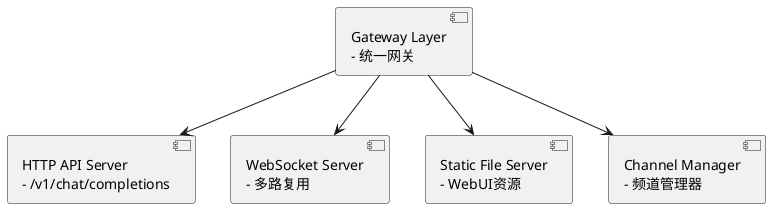
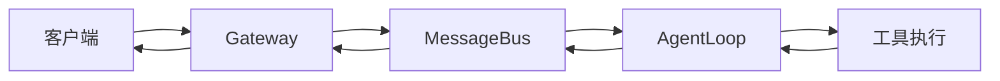

# nanobot Gateway 架构原理分析

## 网关含义

网关是一个统一的接入点，在网络架构中充当不同系统、协议或服务之间的中介。在nanobot中，网关是一个统一的接入网关，**作为所有聊天平台的统一入口点**。


## 1. Gateway 核心定位

nanobot gateway是一个**统一的接入网关**，它的核心作用是：

- 作为所有聊天平台的统一入口点（WebSocket、HTTP API、Telegram等）
- 提供HTTP API接口供外部集成
- 服务WebUI用户界面
- 管理多路复用的WebSocket连接

## 2. 架构设计原理

### 分层架构



### 核心代码

```python
    async def run():
        try:
            await cron.start()
            await heartbeat.start()
            tasks = [
                agent.run(), # 启动agent，不停从消息总线消费
                channels.start_all(), # 启动所有channel(通信频道)
                _health_server(config.gateway.host, port),
            ]
            await asyncio.gather(*tasks)


```


  agent.run() 的核心就是一个永不停止的消息消费循环：

1. 持续监听消息总线  asyncio.wait_for(self.bus.consume_inbound(), timeout=1.0)
2. 快速分发到对应处理逻辑
3. 并发处理多个会话session (cross-session concurrent)
4. 优雅处理各种异常情况


### 组件职责划分

#### A. ChannelManager (频道管理器)

- **发现机制**：通过 `pkgutil`扫描和 `entry_points`插件发现所有频道
- **生命周期管理**：启动/停止各个频道
- **消息路由**：协调 inbound/outbound 消息流
- **会话管理**：为每个连接维护独立的聊天会话

#### B. AgentLoop (代理核心)

- 每个WebSocket连接对应一个独立的Agent实例
- 处理消息、调用工具、生成响应
- 支持流式输出和实时交互

#### C. SessionManager (会话管理器)

- 管理多个独立的会话状态
- 支持持久化和恢复
- 实现会话隔离


  在 nanobot 中，网关解决了这样的问题：

- 用户要通过Web聊天，需要WebSocket连接
- 用户要通过API调用，需要HTTP接口
- 用户要通过Telegram，需要Bot API
- 所有这些连接都通过网关统一管理，实现了"**一次接入，多平台服务**"。

## 3. WebSocket 多路复用原理

### 协议设计

nanobot WebSocket支持多客户端连接，每个连接有唯一的 `chat_id`：

```python
# 连接URL格式
ws://{host}:{port}{path}?client_id=xxx&token=xxx

# 消息路由
每个连接 → 独立chat_id → 独立会话 → 独立Agent实例
```

### 连接管理

```python
class WebSocketChannel(BaseChannel):
    # 1. 接收WebSocket连接
    async def handle_connection(self, websocket, path):
        # 2. 解析client_id和token
        client_id = self._parse_client_id(websocket)
    
        # 3. 创建/获取会话
        session = self.session_manager.get_or_create(client_id)
    
        # 4. 启动消息处理循环
        await self._message_loop(websocket, session)
```

## 4. HTTP API 兼容性设计

### OpenAI 兼容接口

```python
# 标准OpenAI API格式
POST /v1/chat/completions
{
    "model": "nanobot",
    "messages": [{"role": "user", "content": "Hello"}],
    "stream": true
}
```

### 请求处理流程

```python
def handle_chat_completion(request):
    # 1. 提取消息和参数
    messages = request.json()["messages"]
  
    # 2. 转换为nanobot消息格式
    inbound_msg = InboundMessage(
        role="user",
        content=messages[-1]["content"],
        channel="api",
        chat_id="api:default"
    )
  
    # 3. 发送到消息总线
    await bus.send(inbound_msg)
  
    # 4. 流式返回响应
    async for chunk in response_stream:
        yield SSE格式数据
```

## 5. WebUI 集成原理

### 嵌入式资源服务

```python
# WebUI构建物嵌入
nanobot/web/dist/  # 构建输出目录
    ├── index.html
    ├── assets/
    └── static/

# Gateway服务静态文件
def serve_static_file(request):
    path = request.path.lstrip("/")
    return web.FileResponse(f"dist/{path}")
```

### 开发模式代理

```python
# 开发时代理到Vite服务器
{
    "/api": "http://localhost:5173/api",
    "/webui": "http://localhost:5173/webui",
    "ws://": "ws://localhost:5173/"
}
```

## 6. 安全设计原理

### Token认证机制

```python
class TokenManager:
    # 静态Token
    token: str = "static-secret"
  
    # 动态Token Issue API
    token_issue_path: str = "/auth/token"
    token_issue_secret: str = "issue-secret"
  
    # Token验证
    async def verify_token(self, token: str, client_id: str) -> bool:
        # 1. 检查静态Token
        if token == self.token:
            return True
        
        # 2. 检查动态Token
        stored = await self.cache.get(f"token:{client_id}")
        return stored and stored == token
```

### 访问控制

```python
# allow_from 配置
allow_from: list[str] = ["*"]  # 允许所有来源
# 或特定域名
allow_from: list[str] = ["https://example.com"]
```

## 7. 消息路由原理

### 事件驱动架构



### 多频道协调

```python
class ChannelManager:
    async def route_message(self, msg: OutboundMessage):
        # 根据消息目标路由到对应频道
        for channel_name, channel in self.channels.items():
            if msg.channel == channel_name or msg.channel == "all":
                await channel.send(msg)
```

## 8. 容错与恢复机制

### 心跳机制

```python
# WebSocket心跳
ping_interval_s: float = 20.0
ping_timeout_s: float = 20.0

# 重试机制
_SEND_RETRY_DELAYS = (1, 2, 4)  # 指数退避
```

### 会话持久化

```python
class SessionManager:
    async def save_session(self, chat_id: str, session: Session):
        # 定期保存会话状态
        await self._storage.save(chat_id, session.serialize())
  
    async def restore_session(self, chat_id: str) -> Session | None:
        # 恢复会话状态
        data = await self._storage.load(chat_id)
        return Session.deserialize(data) if data else None
```

## 9. 性能优化原理

### 连接复用

- 单个WebSocket连接支持长时间交互
- 连接池管理减少握手开销
- 消息队列缓冲处理高并发

### 资源管理

```python
# 内存限制
max_message_bytes: int = 1_048_576  # 1MB
context_window_tokens: int = 128_000  # 上下文窗口

# 会话清理
session_ttl_minutes: int = 1440  # 24小时TTL
```

## 10. 扩展性设计

### 插件化架构

```python
# 自动发现频道
def discover_all() -> dict[str, type[BaseChannel]]:
    return {
        entry.name: entry.load()
        for entry in pkgutil.iter_modules(__path__)
    }

# 动态加载
def load_channel(name: str) -> BaseChannel:
    cls = discover_all()[name]
    return cls(config, bus)
```

### 配置驱动

```json
{
    "channels": {
        "websocket": {
            "enabled": true,
            "host": "0.0.0.0",
            "port": 8765,
            "token": "secret"
        },
        "telegram": {
            "enabled": true,
            "token": "${TELEGRAM_TOKEN}"
        }
    }
}
```

## 11. 核心代码分析

### Gateway启动流程

```python
def _run_gateway(config: Config, port: int | None = None):
    # 1. 初始化组件
    bus = MessageBus()
    session_manager = SessionManager(config.workspace_path)
    channel_manager = ChannelManager(config, bus, session_manager)
  
    # 2. 创建Agent实例
    agent = AgentLoop(
        bus=bus,
        provider=provider,
        workspace=config.workspace_path,
        # ... 其他配置
    )
  
    # 3. 启动WebSocket服务
    await websocket_channel.start()
  
    # 4. 保持运行
    await asyncio.gather(*channel_manager.running_tasks())
```

### WebSocket消息处理

```python
async def _message_loop(self, websocket: ServerConnection, session_id: str):
    while True:
        try:
            # 1. 接收消息
            message = await websocket.recv()
        
            # 2. 解析消息格式
            data = json.loads(message)
        
            # 3. 创建InboundMessage
            inbound = InboundMessage(
                content=data["content"],
                role=data["role"],
                channel="websocket",
                chat_id=session_id,
                metadata=data.get("metadata", {})
            )
        
            # 4. 发送到消息总线
            await self.bus.send(inbound)
        
            # 5. 等待响应
            async for response in self.bus.subscribe(session_id):
                await websocket.send(json.dumps(response))
            
        except ConnectionClosed:
            break
```

## 12. 设计原则总结

nanobot gateway的核心设计理念是**"统一接入、分层解耦、安全可靠"**。

### 核心优势

1. **统一入口**：所有聊天平台和API接口通过Gateway接入
2. **会话隔离**：每个连接维护独立的会话状态
3. **安全可控**：Token认证和访问控制机制
4. **性能优化**：连接复用和资源管理
5. **易于扩展**：插件化架构支持快速添加新频道

### 适用场景

- **个人AI助手**：通过多种聊天平台接入
- **企业级部署**：统一的API网关和安全控制
- **开发集成**：标准的OpenAI兼容接口
- **Web应用**：嵌入式UI和实时交互

### 技术特点

- **异步架构**：基于asyncio的高性能处理
- **事件驱动**：消息总线解耦各组件
- **流式处理**：支持实时交互和流式响应
- **模块化设计**：易于维护和扩展
- **生产就绪**：包含监控、日志、容错等特性

这种设计使得nanobot既能作为个人AI助手使用，也能作为企业级AI服务部署，实现了从开发环境到生产环境的无缝衔接。

## 13. 代码执行路径分析

执行 `nanobot gateway` 命令时的具体代码路径如下：

### 入口流程

```
nanobot gateway
↓
python -m nanobot gateway
↓
nanobot/__main__.py → nanobot/cli/commands.py
```

### 具体执行步骤

**步骤1: 程序入口**

- `nanobot-0.1.5.post2/nanobot/__main__.py`
- 导入并调用 `nanobot.cli.commands.app()`

**步骤2: CLI路由**

- `nanobot-0.1.5.post2/nanobot/cli/commands.py` (第632行)
- `@app.command()` 装饰的 `gateway()` 函数
- 调用 `_run_gateway()` 函数

**步骤3: 核心运行时**

- `nanobot-0.1.5.post2/nanobot/cli/commands.py` (第647行)
- `_run_gateway()` 函数是主要的实现

### 关键代码文件清单

**主要执行文件：**

1. `nanobot-0.1.5.post2/nanobot/__main__.py` - 入口点
2. `nanobot-0.1.5.post2/nanobot/cli/commands.py` - CLI命令定义

**核心组件文件：**
3. `nanobot-0.1.5.post2/nanobot/channels/manager.py` - 频道管理器
4. `nanobot-0.1.5.post2/nanobot/channels/websocket.py` - WebSocket频道实现
5. `nanobot-0.1.5.post2/nanobot/agent/loop.py` - 代理核心循环
6. `nanobot-0.1.5.post2/nanobot/bus/queue.py` - 消息总线
7. `nanobot-0.1.5.post2/nanobot/session/manager.py` - 会话管理器

### `_run_gateway()` 函数的关键步骤

```python
# 在 commands.py 第647行
def _run_gateway(config: Config, port: int | None = None):
    # 1. 初始化消息总线
    bus = MessageBus()
  
    # 2. 创建LLM提供商
    provider = _make_provider(config)
  
    # 3. 创建会话管理器
    session_manager = SessionManager(config.workspace_path)
  
    # 4. 创建定时任务服务
    cron = CronService(cron_store_path)
  
    # 5. 创建Agent循环
    agent = AgentLoop(...)
  
    # 6. 创建频道管理器
    channels = ChannelManager(config, bus, session_manager=session_manager)
  
    # 7. 创建心跳服务
    heartbeat = HeartbeatService(...)
  
    # 8. 启动所有服务
    await channels.start_all()
    await heartbeat.start()
  
    # 9. 保持运行
    ...
```

### 实际执行的代码路径

当你执行 `nanobot gateway` 时，实际的代码执行顺序是：

1. `nanobot/__main__.py` - 程序入口
2. `nanobot/cli/commands.py:632` - gateway命令定义
3. `nanobot/cli/commands.py:647` - `_run_gateway()` 主函数
4. `nanobot/channels/manager.py` - 创建并启动频道管理器
5. `nanobot/channels/websocket.py` - 启动WebSocket服务器
6. `nanobot/agent/loop.py` - 创建Agent实例
7. `nanobot/bus/queue.py` - 启动消息总线
8. `nanobot/session/manager.py` - 初始化会话管理

**总结：执行 `nanobot gateway` 主要运行的是 `/home/10346371@zte.intra/codes/nanobot-0.1.5.post2/nanobot/cli/commands.py` 文件中的 `gateway()` 和 `_run_gateway()` 函数，这个函数会初始化并启动整个nanobot网关服务。
