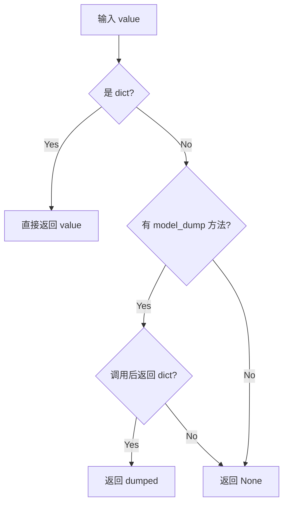

# LLMProvider 基类详解

## 核心定位

`LLMProvider` 是一个**抽象基类（ABC）**，为所有 LLM 提供商定义统一的接口和基础功能。它是整个多提供商适配器的核心基础类。
最重要的接口：chat, stream_chat, chat_with_retry;
LLMResponse、ToolResponse。

## 类结构概览

```python
from abc import ABC, abstractmethod

class LLMProvider(ABC):
    """Base class for LLM providers."""
    pass
```

---

## 主要组成部分

### 1. 核心数据类

#### **LLMResponse** - LLM 响应封装
```python
@dataclass
class LLMResponse:
    """Response from an LLM provider."""
    # 基本响应内容
    content: str | None                    # 文本内容
    tool_calls: list[ToolCallRequest]      # 工具调用列表
    finish_reason: str = "stop"            # 结束原因
    usage: dict[str, int]                  # token 使用统计
    
    # 高级功能
    retry_after: float | None              # 提供商建议的重试等待时间（秒）
    reasoning_content: str | None          # 推理内容（Kimi、DeepSeek-R1等）
    thinking_blocks: list[dict] | None     # Anthropic 扩展思考块
    
    # 结构化错误元数据
    error_status_code: int | None          # HTTP 状态码
    error_kind: str | None                 # 错误类型（timeout, connection等）
    error_type: str | None                 # 提供商语义类型
    error_code: str | None                 # 提供商错误代码
    error_retry_after_s: float | None      # 错误重试时间
    error_should_retry: bool | None        # 是否应该重试
```

#### **ToolCallRequest** - 工具调用请求
```python
@dataclass
class ToolCallRequest:
    """A tool call request from the LLM."""
    id: str                                # 工具调用ID
    name: str                              # 工具名称
    arguments: dict[str, Any]              # 工具参数
    extra_content: dict[str, Any] | None   # 额外内容
    provider_specific_fields: dict[str, Any] | None     # 提供商特定字段
    function_provider_specific_fields: dict[str, Any] | None  # 函数特定字段
```

#### **GenerationSettings** - 生成设置
```python
@dataclass(frozen=True)
class GenerationSettings:
    """Default generation settings."""
    temperature: float = 0.7               # 采样温度
    max_tokens: int = 4096                 # 最大生成token数
    reasoning_effort: str | None = None    # 推理努力程度
```

### 2. 重试机制配置

```python
# 重试延迟序列（秒）
_CHAT_RETRY_DELAYS = (1, 2, 4)              # 标准重试：1秒、2秒、4秒

# 持久重试配置
_PERSISTENT_MAX_DELAY = 60                   # 持久重试最大延迟（秒）
_PERSISTENT_IDENTICAL_ERROR_LIMIT = 10       # 持久重试相同错误限制
_RETRY_HEARTBEAT_CHUNK = 30                  # 重试心跳间隔（秒）

# 瞬态错误标记
_TRANSIENT_ERROR_MARKERS = (
    "429", "rate limit", "500", "502", "503", "504",
    "overloaded", "timeout", "timed out",
    "connection", "server error", "temporarily unavailable",
)

# 可重试状态码
_RETRYABLE_STATUS_CODES = frozenset({408, 409, 429})
_TRANSIENT_ERROR_KINDS = frozenset({"timeout", "connection"})

# 429 错误分类
_NON_RETRYABLE_429_ERROR_TOKENS = frozenset({
    "insufficient_quota", "quota_exceeded", "quota_exhausted",
    "billing_hard_limit_reached", "insufficient_balance",
})

_RETRYABLE_429_ERROR_TOKENS = frozenset({
    "rate_limit_exceeded", "rate_limit_error",
    "too_many_requests", "request_limit_exceeded",
})
```

### 3. 核心抽象方法

#### **chat()** - 发送聊天请求
```python
@abstractmethod
async def chat(
    self,
    messages: list[dict[str, Any]],         # 消息列表
    tools: list[dict[str, Any]] | None = None,  # 工具定义
    model: str | None = None,               # 模型标识符
    max_tokens: int = 4096,                 # 最大token数
    temperature: float = 0.7,               # 采样温度
    reasoning_effort: str | None = None,    # 推理努力程度
    tool_choice: str | dict[str, Any] | None = None,  # 工具选择策略
) -> LLMResponse:
    """
    Send a chat completion request.
    
    子类必须实现此方法，提供具体的 LLM 调用逻辑。
    """
    pass
```

#### **get_default_model()** - 获取默认模型
```python
@abstractmethod
def get_default_model(self) -> str:
    """
    Get the default model for this provider.
    
    子类必须实现此方法，返回提供商的默认模型名称。
    """
    pass
```

### 4. 核心功能方法

#### **A. 聊天方法组**

```python
# 基础聊天（抽象方法，子类实现）
async def chat(...) -> LLMResponse

# 流式聊天（默认实现回退到 chat）
async def chat_stream(
    messages, tools, model, max_tokens, temperature,
    reasoning_effort, tool_choice,
    on_content_delta: Callable[[str], Awaitable[None]] | None = None
) -> LLMResponse:
    """
    Stream a chat completion, calling on_content_delta for each text chunk.
    默认实现回退到非流式调用，提供商可以重写此方法以支持原生流式。
    """

# 带重试的聊天
async def chat_with_retry(
    messages, tools, model, max_tokens, temperature,
    reasoning_effort, tool_choice,
    retry_mode: str = "standard",           # 重试模式：standard/persistent
    on_retry_wait: Callable[[str], Awaitable[None]] | None = None
) -> LLMResponse:
    """
    Call chat() with retry on transient provider failures.
    自动重试瞬态错误，支持标准重试和持久重试两种模式。
    """

# 带重试的流式聊天
async def chat_stream_with_retry(
    messages, tools, model, max_tokens, temperature,
    reasoning_effort, tool_choice,
    on_content_delta, retry_mode, on_retry_wait
) -> LLMResponse
```

#### **B. 错误处理组**

```python
# 判断是否为瞬态错误（基于文本标记）
@classmethod
def _is_transient_error(cls, content: str | None) -> bool:
    """
    检查错误内容是否包含瞬态错误标记。
    瞬态错误包括：网络问题、超时、限流、服务器错误等。
    """

# 判断响应是否可重试（优先使用结构化元数据）
@classmethod
def _is_transient_response(cls, response: LLMResponse) -> bool:
    """
    Prefer structured error metadata, fallback to text markers for legacy providers.
    优先使用结构化错误元数据，回退到文本标记判断。
    """

# 判断 429 错误是否可重试
@classmethod
def _is_retryable_429_response(cls, response: LLMResponse) -> bool:
    """
    细粒度判断 429 错误是否可重试。
    区分配额不足（不可重试）和速率限制（可重试）。
    """

# 提取错误类型和代码
@classmethod
def _extract_error_type_code(cls, payload: Any) -> tuple[str | None, str | None]:
    """
    从错误响应中提取错误类型和代码。
    支持 JSON 和字符串格式。
    """
```

#### **C. 消息清理组**

```python
# 清理空内容块
@staticmethod
def _sanitize_empty_content(messages: list[dict[str, Any]]) -> list[dict[str, Any]]:
    """
    Sanitize message content: fix empty blocks, strip internal _meta fields.
    修复空内容块，移除内部 _meta 字段。
    """

# 仅保留安全的消息键
@staticmethod
def _sanitize_request_messages(
    messages: list[dict[str, Any]],
    allowed_keys: frozenset[str]
) -> list[dict[str, Any]]:
    """
    Keep only provider-safe message keys and normalize assistant content.
    仅保留提供商安全的消息键，规范化助手内容。
    """

# 移除图片内容（用于错误降级）
@staticmethod
def _strip_image_content(messages: list[dict[str, Any]]) -> list[dict[str, Any]] | None:
    """
    Replace image_url blocks with text placeholder.
    将图片URL块替换为文本占位符，用于错误时降级重试。
    """
```

#### **D. 重试逻辑组**

```python
# 执行带重试的调用
async def _run_with_retry(
    call: Callable[..., Awaitable[LLMResponse]],  # 要调用的函数
    kw: dict[str, Any],                            # 函数参数
    original_messages: list[dict[str, Any]],       # 原始消息
    retry_mode: str,                               # 重试模式
    on_retry_wait: Callable[[str], Awaitable[None]] | None  # 重试等待回调
) -> LLMResponse:
    """
    Call with retry on transient provider failures.
    核心重试逻辑：
    1. 调用函数
    2. 检查是否为瞬态错误
    3. 计算重试延迟
    4. 等待并重试
    """

# 提取重试延迟时间（从文本）
@classmethod
def _extract_retry_after(cls, content: str | None) -> float | None:
    """
    从错误文本中提取重试延迟时间。
    支持多种格式：
    - "retry after 30s"
    - "try again in 1 minute"
    - "wait 500ms before retry"
    """

# 提取重试延迟时间（从响应头）
@classmethod
def _extract_retry_after_from_headers(cls, headers: Any) -> float | None:
    """
    从 HTTP 响应头中提取重试延迟时间。
    支持：
    - Retry-After: 60（秒数）
    - Retry-After: Wed, 21 Oct 2026 07:28:00 GMT（日期）
    """

# 带心跳的睡眠
async def _sleep_with_heartbeat(
    self,
    delay: float,
    attempt: int,
    persistent: bool,
    on_retry_wait: Callable[[str], Awaitable[None]] | None = None
) -> None:
    """
    带心跳的睡眠，支持定期调用回调函数。
    避免长时间静默，保持连接活跃。
    """
```

---

## 核心作用

### 1. **统一接口**
为所有 LLM 提供商（OpenAI、DeepSeek、Zhipu、Gemini等）提供统一的 API，实现**提供商无关**的调用方式。

### 2. **智能重试**
- **瞬态错误重试**：网络问题、限流（429）、服务器错误（500+）
- **持久重试模式**：无限重试直到成功
- **标准重试模式**：重试3次（1s → 2s → 4s）
- **图片降级**：遇到错误时自动移除图片内容重试
- **心跳机制**：长时间等待时保持连接活跃

### 3. **错误处理**
- 区分**可重试**和**不可重试**的错误
- 提取结构化错误元数据
- 支持429错误的细粒度判断（配额不足 vs 限流）
- 从响应头和文本中提取重试延迟

### 4. **消息规范化**
- 清理空内容块
- 移除内部 `_meta` 字段
- 处理不同提供商的消息格式差异
- 仅保留提供商安全的字段

### 5. **工具调用支持**
- 统一的 `ToolCallRequest` 格式
- 支持 OpenAI 和 Anthropic 风格的工具调用
- 自动序列化为 OpenAI 格式

### 6. **流式响应支持**
- 统一的流式接口
- 默认回退到非流式实现
- 实时内容增量回调

---

## 使用示例

### **提供商实现示例**

```python
from providers.base import LLMProvider
from providers.registry import ProviderSpec

class OpenAICompatProvider(LLMProvider):
    """OpenAI 兼容提供商实现"""
    
    def __init__(self, api_key: str, api_base: str, spec: ProviderSpec):
        super().__init__(api_key, api_base)
        self.spec = spec
        self.client = openai.AsyncOpenAI(api_key=api_key, base_url=api_base)
    
    async def chat(
        self, messages, tools, model, max_tokens, 
        temperature, reasoning_effort, tool_choice
    ) -> LLMResponse:
        """实现具体的 OpenAI 调用逻辑"""
        try:
            response = await self.client.chat.completions.create(
                model=model or self.get_default_model(),
                messages=messages,
                tools=tools,
                max_tokens=max_tokens,
                temperature=temperature,
                tool_choice=tool_choice
            )
            return self._parse_response(response)
        except Exception as e:
            return LLMResponse(
                content=f"Error: {e}",
                finish_reason="error"
            )
    
    def get_default_model(self) -> str:
        return "gpt-4o-mini"
```

### **调用示例**

```python
# 初始化提供商
provider = OpenAICompatProvider(
    api_key="sk-xxx",
    api_base="https://api.openai.com/v1",
    spec=find_by_name("openai")
)

# 标准聊天
response = await provider.chat_with_retry(
    messages=[{"role": "user", "content": "Hello"}],
    retry_mode="standard"
)

# 持久重试聊天
response = await provider.chat_with_retry(
    messages=[{"role": "user", "content": "Complex task"}],
    retry_mode="persistent"  # 无限重试直到成功
)

# 流式聊天
async def on_text_delta(text: str):
    print(text, end="", flush=True)

response = await provider.chat_stream_with_retry(
    messages=[{"role": "user", "content": "Tell me a story"}],
    on_content_delta=on_text_delta  # 实时显示
)

# 带工具调用的聊天
response = await provider.chat_with_retry(
    messages=[{"role": "user", "content": "What's the weather?"}],
    tools=[{
        "type": "function",
        "function": {
            "name": "get_weather",
            "description": "Get current weather",
            "parameters": {
                "type": "object",
                "properties": {
                    "location": {"type": "string"}
                }
            }
        }
    }]
)

if response.has_tool_calls:
    for tool_call in response.tool_calls:
        print(f"Tool: {tool_call.name}, Args: {tool_call.arguments}")
```

---

## 设计优势

| 特性 | 好处 |
|------|------|
| **抽象基类** | 强制子类实现核心方法，确保接口一致 |
| **智能重试** | 自动处理临时故障，提高成功率 |
| **错误分类** | 区分可重试/不可重试错误，避免无谓重试 |
| **消息清理** | 处理不同提供商的格式差异 |
| **流式支持** | 统一的流式接口，默认回退实现 |
| **工具调用** | 统一的工具调用格式，跨提供商兼容 |
| **结构化错��** | 完善的错误元数据，便于调试和监控 |
| **心跳机制** | 长时间等待时保持连接活跃 |

---

## 重试机制详解

### **重试模式**

#### **标准重试 (standard)**
```python
# 重试3次，延迟递增：1秒 → 2秒 → 4秒
response = await provider.chat_with_retry(
    messages=messages,
    retry_mode="standard"
)
```

#### **持久重试 (persistent)**
```python
# 无限重试，最大延迟60秒
response = await provider.chat_with_retry(
    messages=messages,
    retry_mode="persistent"
)
```

### **重试条件**

#### **可重试的错误**
- 网络超时（timeout）
- 连接错误（connection）
- 速率限制（429 rate_limit_exceeded）
- 服务器错误（500, 502, 503, 504）
- 请求超时（408）

#### **不可重试的错误**
- 配额不足（insufficient_quota）
- 认证失败（401, 403）
- 参数错误（400）
- 找不到资源（404）

### **重试延迟计算**

```python
# 优先级从高到低：
# 1. 提供商明确指定的延迟
retry_after = response.retry_after

# 2. 从错误文本中提取的延迟
retry_after = _extract_retry_after(response.content)

# 3. 默认重试延迟序列
retry_after = _CHAT_RETRY_DELAYS[attempt % 3]  # 1, 2, 4
```

---

## 总结

`LLMProvider` 是整个多提供商适配器的**核心基础类**，提供了：

✅ **统一接口** - 提供商无关的调用方式  
✅ **智能重试** - 自动处理瞬态错误  
✅ **完善错误处理** - 结构化错误元数据  
✅ **消息规范化** - 处理格式差异  
✅ **工具调用支持** - 跨提供商兼容  
✅ **流式响应** - 统一的流式接口  
✅ **可扩展性** - 易于添加新提供商  

通过继承 `LLMProvider`，新的提供商只需实现核心的 `chat()` 和 `get_default_model()` 方法，即可自动获得所有高级功能：重试、错误处理、消息清理等。

---

## `_run_with_retry` 函数深度解析

`_run_with_retry` 是整个重试机制的核心函数，实现了智能的错误分类、重试策略和降级处理。

### **函数签名**

```python
async def _run_with_retry(
    self,
    call: Callable[..., Awaitable[LLMResponse]],  # 要调用的异步函数
    kw: dict[str, Any],                           # 函数参数
    original_messages: list[dict[str, Any]],      # 原始消息（用于降级）
    *,
    retry_mode: str,                              # 重试模式："standard" 或 "persistent"
    on_retry_wait: Callable[[str], Awaitable[None]] | None,  # 重试等待回调
) -> LLMResponse:
```

### **参数说明**

| 参数 | 类型 | 说明 |
|------|------|------|
| `call` | `Callable` | 要执行的异步函数（如 `self.chat` 或 `self.chat_stream`） |
| `kw` | `dict` | 传递给 `call` 函数的参数字典 |
| `original_messages` | `list` | 原始消息列表，用于图片降级重试 |
| `retry_mode` | `str` | 重试模式：`"standard"`（标准）或 `"persistent"`（持久） |
| `on_retry_wait` | `Callable` | 重试等待时的回调函数，用于通知用户等待状态 |

---

### **初始化阶段**

```python
attempt = 0                                    # 当前尝试次数
delays = list(self._CHAT_RETRY_DELAYS)         # 重试延迟序列：[1, 2, 4]
persistent = retry_mode == "persistent"        # 是否为持久重试模式
last_response: LLMResponse | None = None       # 上一次的响应
last_error_key: str | None = None              # 上一次错误的唯一标识
identical_error_count = 0                      # 相同错误计数器
```

---

### **主循环逻辑**

```python
while True:  # 无限循环，直到成功或达到停止条件
    attempt += 1  # 尝试次数递增
    
    # 调用目标函数
    response = await call(**kw)
    
    # 成功：直接返回
    if response.finish_reason != "error":
        return response
```

---

### **错误处理机制**

#### **1. 相同错误检测**

```python
# 生成错误的唯一标识（错误内容的哈希）
error_key = ((response.content or "").strip().lower() or None)

# 检测是否为相同的错误
if error_key and error_key == last_error_key:
    identical_error_count += 1  # 相同错误计数+1
else:
    last_error_key = error_key
    identical_error_count = 1 if error_key else 0  # 重置计数
```

**作用：** 防止陷入相同错误的无限循环

#### **2. 不可重试错误处理**

```python
if not self._is_transient_response(response):
    # 检查是否包含图片内容
    stripped = self._strip_image_content(original_messages)
    
    # 如果有图片，尝试移除图片后重试（降级策略）
    if stripped is not None and stripped != kw["messages"]:
        logger.warning("Non-transient LLM error with image content, retrying without images")
        retry_kw = dict(kw)
        retry_kw["messages"] = stripped  # 替换为无图片版本
        return await call(**retry_kw)
    
    # 真正的不可重试错误，直接返回
    return response
```

**降级策略：** 遇到错误时，如果消息包含图片，自动移除图片后重试一次

**示例：**
```python
# 原始消息
messages = [
    {"role": "user", "content": [
        {"type": "text", "text": "描述这张图片"},
        {"type": "image_url", "url": "https://..."}
    ]}
]

# 降级后的消息
messages = [
    {"role": "user", "content": [
        {"type": "text", "text": "描述这张图片 [image omitted]"}
    ]}
]
```

#### **3. 持久重试的相同错误限制**

```python
if persistent and identical_error_count >= self._PERSISTENT_IDENTICAL_ERROR_LIMIT:
    # 持久重试模式下，相同错误超过10次则停止
    logger.warning(
        "Stopping persistent retry after {} identical transient errors: {}",
        identical_error_count,
        (response.content or "")[:120].lower(),
    )
    return response
```

**保护机制：** 避免持久重试陷入死循环

#### **4. 标准重试的次数限制**

```python
if not persistent and attempt > len(delays):
    # 标准模式下，重试次数超过延迟序列长度则停止
    break
```

---

### **重试延迟计算**

#### **延迟计算优先级**

```python
# 1. 基础延迟（从延迟序列中获取）
base_delay = delays[min(attempt - 1, len(delays) - 1)]
# 第1次重试：1秒
# 第2次重试：2秒
# 第3次重试：4秒
# 第4+次重试：4秒（取最后一个值）

# 2. 尝试从响应中提取提供商建议的延迟
delay = self._extract_retry_after_from_response(response) or base_delay

# 3. 持久重试模式下，限制最大延迟
if persistent:
    delay = min(delay, self._PERSISTENT_MAX_DELAY)  # 最大60秒
```

#### **延迟提取函数**

```python
@classmethod
def _extract_retry_after_from_response(cls, response: LLMResponse) -> float | None:
    """从响应中提取重试延迟时间"""
    # 优先级：
    # 1. 结构化错误元数据中的延迟
    if response.error_retry_after_s is not None and response.error_retry_after_s > 0:
        return response.error_retry_after_s
    
    # 2. 响应中的延迟字段
    if response.retry_after is not None and response.retry_after > 0:
        return response.retry_after
    
    # 3. 从错误文本中提取延迟
    return cls._extract_retry_after(response.content)
```

**支持的延迟格式：**
- `"retry after 30s"`
- `"try again in 1 minute"`
- `"wait 500ms before retry"`
- HTTP 响应头 `Retry-After: 60`

---

### **重试日志和等待**

#### **记录重试日志**

```python
logger.warning(
    "LLM transient error (attempt {}{}), retrying in {}s: {}",
    attempt,  # 当前尝试次数
    "+" if persistent and attempt > len(delays) else f"/{len(delays)}",  # 重试状态
    int(round(delay)),  # 延迟时间（秒）
    (response.content or "")[:120].lower(),  # 错误信息（前120字符）
)
```

**日志示例：**
```
# 标准重试
"LLM transient error (attempt 1/3), retrying in 2s: rate limit exceeded"

# 持久重试（超过3次）
"LLM transient error (attempt 5+), retrying in 4s: connection timeout"
```

#### **带心跳的等待**

```python
await self._sleep_with_heartbeat(
    delay,                    # 总延迟时间
    attempt=attempt,          # 当前尝试次数
    persistent=persistent,    # 是否为持久重试
    on_retry_wait=on_retry_wait,  # 用户回调
)
```

**心跳机制实现：**

```python
async def _sleep_with_heartbeat(self, delay: float, **kwargs) -> None:
    """将长延迟分割为小块，定期调用回调保持活跃"""
    remaining = max(0.0, delay)
    while remaining > 0:
        # 调用用户回调，通知等待状态
        if on_retry_wait:
            kind = "persistent retry" if persistent else "retry"
            await on_retry_wait(
                f"Model request failed, {kind} in {max(1, int(round(remaining)))}s "
                f"(attempt {attempt})."
            )
        
        # 每次最多等待30秒（_RETRY_HEARTBEAT_CHUNK）
        chunk = min(remaining, self._RETRY_HEARTBEAT_CHUNK)
        await asyncio.sleep(chunk)
        remaining -= chunk
```

**好处：**
- 避免长时间静默
- 保持连接活跃
- 定期通知用户进度

---

### **完整执行流程图**

```
开始
  ↓
初始化变量 (attempt=0, delays=[1,2,4], ...)
  ↓
┌──────────────────────────────┐
│  while True:                 │
│  attempt += 1                │
│  response = await call(**kw) │
└──────────────────────────────┘
  ↓
response.finish_reason != "error"?
  ├─ 是 → 返回 response ✅
  └─ 否 ↓
      
判断错误类型
  ↓
┌─────────────────────────────────────────┐
│ 是否为瞬态错误？                         │
│ _is_transient_response(response)        │
└─────────────────────────────────────────┘
  ├─ 否 → 是否有图片内容？
  │        ├─ 是 → 移除图片重试一次 → 返回结果
  │        └─ 否 → 返回错误 ❌
  │
  └─ 是 ↓
      
检查重试条件
  ↓
┌─────────────────────────────────────────┐
│ 持久重试 && 相同错误 >= 10次？           │
│ persistent && identical_error_count >= 10│
└─────────────────────────────────────────┘
  ├─ 是 → 返回错误 ❌（避免死循环）
  │
  └─ 否 ↓
      
┌─────────────────────────────────────────┐
│ 标准重试 && attempt > 3？               │
│ not persistent && attempt > len(delays) │
└─────────────────────────────────────────┘
  ├─ 是 → break（跳出循环）
  │
  └─ 否 ↓
      
计算重试延迟
  ↓
delay = extract_delay(response) or base_delay
if persistent: delay = min(delay, 60)
  ↓
记录日志 + 等待（带心跳）
  ↓
继续循环（回到顶部）
```

---

### **实际使用示例**

#### **示例1：标准重试流程**

```python
# 配置
delays = [1, 2, 4]  # 重试延迟序列

# 执行流程
Attempt 1: 失败（rate limit）
  → 等待 1 秒
  → 重试

Attempt 2: 失败（rate limit）
  → 等待 2 秒
  → 重试

Attempt 3: 失败（rate limit）
  → 等待 4 秒
  → 重试

Attempt 4: 失败（rate limit）
  → attempt > len(delays) (4 > 3)
  → break，返回错误 ❌
```

#### **示例2：持久重试流程**

```python
# 配置
retry_mode = "persistent"
max_delay = 60

# 执行流程
Attempt 1-3: 失败
  → 延迟：1秒 → 2秒 → 4秒

Attempt 4-10: 失败
  → 延迟：4秒（固定）

Attempt 11+: 失败
  → 延迟：4秒
  → 如果相同错误 >= 10次 → 返回错误 ❌
  → 否则继续重试（理论上无限）
```

#### **示例3：图片降级重试**

```python
# 原始消息包含图片
messages = [
    {"role": "user", "content": [
        {"type": "text", "text": "描述这张图片"},
        {"type": "image_url", "url": "https://example.com/image.jpg"}
    ]}
]

# 执行流程
Attempt 1: 失败（不可重试错误，如400）
  → 检测到图片内容
  → 移除图片，降级为纯文本消息
  → 重试一次：

Attempt 2: 使用降级后的消息
  → messages = [{"role": "user", "content": [{"type": "text", "text": "描述这张图片 [image omitted]"}]}]
  → 如果成功 → 返回结果 ✅
  → 如果失败 → 返回错误 ❌
```

#### **示例4：提供商建议的延迟**

```python
# API 响应包含重试建议
{
    "error": {
        "message": "Rate limit exceeded. Please retry after 5 seconds.",
        "retry_after": 5.0
    }
}

# 执行流程
Attempt 1: 失败
  → 提取延迟：5.0秒（从响应中）
  → 等待 5 秒（而不是使用默认的1秒）
  → 重试

Attempt 2: 成功 ✅
```

---

### **关键特性总结**

#### **1. 智能错误分类**
- ✅ **瞬态错误**：可重试（网络、限流、超时）
- ❌ **永久错误**：不可重试（认证、参数、配额）
- 🖼️ **图片降级**：自动移除图片重试

#### **2. 双重重试模式**

| 模式 | 重试次数 | 最大延迟 | 适用场景 |
|------|----------|----------|----------|
| **standard** | 3次 | 4秒 | 一般场景 |
| **persistent** | 无限 | 60秒 | 关键任务 |

#### **3. 防护机制**
- 🔒 **相同错误限制**：防止死循环（10次）
- 📊 **心跳机制**：长延迟时保持连接活跃
- 📝 **详细日志**：记录每次重试的状态

#### **4. 智能延迟**
- 🎯 **提供商建议**：优先使用响应中的延迟
- ⏱️ **递增延迟**：1秒 → 2秒 → 4秒
- 🚫 **延迟上限**：持久重试最大60秒

---

### **设计优势**

| 特性 | 好处 |
|------|------|
| **错误分类** | 只重试可恢复的错误，避免浪费配额 |
| **降级策略** | 图片失败时自动降级，提高成功率 |
| **心跳机制** | 长时间等待时保持连接，避免超时 |
| **双重模式** | 标准模式节省资源，持久模式确保成功 |
| **防护机制** | 避免陷入错误循环，保护资源 |
| **详细日志** | 便于调试和监控 |
| **提供商感知** | 优先使用提供商建议的延迟时间 |

---

### **使用建议**

#### **何时使用标准重试**
```python
# 一般场景，平衡成功率和资源消耗
response = await provider.chat_with_retry(
    messages=messages,
    retry_mode="standard"  # 默认值
)
```

#### **何时使用持久重试**
```python
# 关键任务，必须成功
response = await provider.chat_with_retry(
    messages=messages,
    retry_mode="persistent"  # 无限重试
)
```

#### **如何监控重试状态**
```python
async def on_wait(message: str):
    """显示重试等待状态"""
    print(f"⏳ {message}")

response = await provider.chat_with_retry(
    messages=messages,
    on_retry_wait=on_wait
)
```

**总结：** `_run_with_retry` 是一个健壮的重试引擎，通过智能错误分类、降级策略、心跳机制和防护措施，在保证成功率的同时避免了资源浪费。它是整个多提供商适配器可靠性的基石！

---

## Pydantic 模型说明

Pydantic 是一个 Python 数据验证库，使用类型注解自动验证和转换数据。它通过继承 `BaseModel` 定义的模型类提供了自动数据验证、类型转换、错误提示和 JSON 序列化等核心功能，确保数据格式正确并提供清晰的错误信息。Pydantic 模型广泛应用于 API 请求/响应验证、配置管理和数据解析场景，相比普通 Python 类提供了更严格的数据保证和更好的开发体验。

在多提供商适配器项目中，OpenAI SDK 返回的响应对象是 Pydantic 模型。项目使用 `model_dump()` 方法将这些 SDK 对象统一转换为字典格式，实现了对不同响应格式（原始 JSON、SDK Pydantic 模型）的统一处理。例如 `_coerce_dict()` 函数会检测对象是否有 `model_dump` 方法，如果有则调用该方法转换为字典，从而兼容处理原始 JSON 响应和 SDK 对象响应，确保数据解析的一致性和可靠性。

---

## Python 类的核心概念：super()、self 和 effective_base

### **1. `super()` - 调用父类方法**

`super()` 是 Python 的内置函数，用于访问和调用父类（基类）的方法，实现代码继承和复用。

#### **在 OpenAICompatProvider 中的应用**

```python
class OpenAICompatProvider(LLMProvider):
    def __init__(self, api_key, api_base, default_model, extra_headers, spec):
        # 调用父类 LLMProvider 的 __init__ 方法
        super().__init__(api_key, api_base)
        
        # 然后执行子类自己的初始化逻辑
        self.default_model = default_model
        self.extra_headers = extra_headers or {}
        self._spec = spec
```

#### **为什么使用 `super()`？**

1. **复用父类初始化逻辑** - 父类已经设置了 `api_key`、`api_base`、`generation` 等属性
2. **避免代码重复** - 不需要在子类中重新编写父类的初始化代码
3. **支持继承链** - 当继承关系改变时，无需修改代码
4. **方法解析顺序（MRO）** - 正确处理多继承情况

---

### **2. `self` - 当前实例对象**

`self` 是 Python 类方法的第一个参数，代表当前实例对象本身，用于访问实例属性和方法。

#### **在 OpenAICompatProvider 中的应用**

```python
class OpenAICompatProvider(LLMProvider):
    def __init__(self, api_key, api_base, default_model, extra_headers, spec):
        super().__init__(api_key, api_base)
        
        # self 指向当前创建的 OpenAICompatProvider 实例
        self.default_model = default_model      # 为当前实例设置属性
        self.extra_headers = extra_headers or {}  # 为当前实例设置属性
        self._spec = spec                       # 为当前实例设置属性
        
        # 使用 self 创建客户端并保存为实例属性
        self._client = AsyncOpenAI(
            base_url=effective_base,
            api_key=api_key
        )
```

#### **`self` 的作用**

1. **区分不同实例** - 每个实例有自己的属性值
2. **实例属性存储** - 将数据保存到实例中
3. **实例方法调用** - 在方法之间共享数据
4. **对象身份标识** - 代表对象本身

#### **实例对比示例**

```python
# 创建两个不同的实例
provider1 = OpenAICompatProvider(
    api_key="sk-key1",
    default_model="gpt-4o"
)

provider2 = OpenAICompatProvider(
    api_key="sk-key2",
    default_model="glm-5"
)

# self 在每个实例中指向不同的对象
print(provider1.default_model)  # "gpt-4o" (provider1 的属性)
print(provider2.default_model)  # "glm-5" (provider2 的属性)
```

---

### **3. `effective_base` - 实际使用的 API 基础 URL**

`effective_base` 是一个局部变量，通过链式或运算计算实际使用的 API 基础地址。

#### **在 OpenAICompatProvider 中的应用**

```python
# 计算实际使用的 API 基础 URL
effective_base = api_base or (spec.default_api_base if spec else None) or None
```

#### **计算逻辑（链式或运算）**

```python
effective_base = (
    api_base or                                    # 1. 优先使用用户提供的 api_base
    (spec.default_api_base if spec else None) or   # 2. 其次使用 spec 中的默认值
    None                                          # 3. 最后回退到 None
)
```

#### **三种情况示例**

```python
# 情况1：用户提供 api_base
provider = OpenAICompatProvider(
    api_base="https://custom.api.com",  # 用户自定义地址
    spec=spec
)
# effective_base = "https://custom.api.com"

# 情况2：用户不提供 api_base，使用 spec 默认值
provider = OpenAICompatProvider(
    api_base=None,
    spec=spec  # spec.default_api_base = "https://api.openai.com/v1"
)
# effective_base = "https://api.openai.com/v1"

# 情况3：既没有用户输入，也没有默认值
provider = OpenAICompatProvider(
    api_base=None,
    spec=None
)
# effective_base = None
```

#### **为什么需要 `effective_base`？**

1. **灵活性** - 支持用户自定义 API 地址（代理、网关等）
2. **默认值** - 当用户不提供时使用注册表中的默认值
3. **容错性** - 优雅处理 None 值，避免程序崩溃
4. **优先级明确** - 用户输入 > 规格默认 > None

---

## 三者执行流程

```python
class OpenAICompatProvider(LLMProvider):
    def __init__(self, api_key, api_base, default_model, extra_headers, spec):
        # 步骤1: super() - 调用父类初始化
        super().__init__(api_key, api_base)
        ↓
        执行父类 LLMProvider.__init__()
        - 设置 self.api_key = api_key
        - 设置 self.api_base = api_base  
        - 创建 self.generation = GenerationSettings()
        
        # 步骤2: self - 为当前实例设置属性
        self.default_model = default_model
        ↓
        将 default_model 保存到当前实例的属性中
        - provider1.self.default_model = "gpt-4o"
        - provider2.self.default_model = "glm-5"
        
        self.extra_headers = extra_headers or {}
        self._spec = spec
        
        # 步骤3: effective_base - 计算实际使用的 API 地址
        effective_base = api_base or (spec.default_api_base if spec else None) or None
        ↓
        链式或运算确定最终值：
        - 如果 api_base 不为 None → 使用 api_base
        - 否则如果 spec 有 default_api_base → 使用 spec.default_api_base
        - 否则 → 使用 None
        
        # 步骤4: 使用 effective_base 创建客户端
        self._client = AsyncOpenAI(
            base_url=effective_base,  # 使用计算出的地址
            api_key=api_key
        )
```

---

## 三者对比说明

| 概念 | 类型 | 作用域 | 生命周期 | 主要用途 |
|------|------|--------|----------|----------|
| **super()** | 函数 | 方法调用时 | 临时（调用期间） | 调用父类方法，实现继承 |
| **self** | 参数/引用 | 整个实例 | 实例存在期间 | 访问实例属性和方法 |
| **effective_base** | 局部变量 | 方法内部 | 方法执行期间 | 存储计算结果，中间值 |

---

## 实际应用示例

```python
# 初始化过程
provider = OpenAICompatProvider(
    api_key="sk-xxx",
    api_base="https://custom.openai.com/v1",  # 用户自定义地址
    default_model="gpt-4o",
    extra_headers={"X-Custom": "value"},
    spec=find_by_name("openai")
)

# 执行流程：
# 1. super().__init__("sk-xxx", "https://custom.openai.com/v1")
#    → 调用父类初始化，设置 self.api_key 和 self.api_base

# 2. self.default_model = "gpt-4o"
#    → 为当前实例设置默认模型

# 3. effective_base = "https://custom.openai.com/v1" or ... 
#    → 计算出实际使用的 API 地址

# 4. self._client = AsyncOpenAI(base_url=effective_base, ...)
#    → 使用计算出的地址创建客户端并保存到实例

# 后续使用
response = await provider.chat(messages=[...])
# 内部使用 self._client（通过 self 访问实例属性）
# 连接到 effective_base 指定的 API 地址
```

---

## 总结

这三个概念在 Python 面向对象编程中扮演不同角色：

- **`super()`** 用于继承和代码复用，让子类能够扩展父类的功能
- **`self`** 用于封装和状态管理，让每个对象维护自己的数据
- **`effective_base`** 用于配置计算，提供灵活的默认值处理机制

在 `OpenAICompatProvider` 中，三者协同工作：`super()` 初始化父类功能，`self` 维护实例状态，`effective_base` 确定最终配置，共同实现了灵活而健壮的提供商适配器！

---

## `_maybe_mapping` 方法详解

### **方法定位**

`_maybe_mapping` 是 `OpenAICompatProvider` 类的核心工具方法，用于统一处理两种不同的响应数据格式。

**源码位置**: `providers/openai_compat_provider.py:318-327`

```python
@staticmethod
def _maybe_mapping(value: Any) -> dict[str, Any] | None:
    if isinstance(value, dict):
        return value
    model_dump = getattr(value, "model_dump", None)
    if callable(model_dump):
        dumped = model_dump()
        if isinstance(dumped, dict):
            return dumped
    return None
```

---

### **核心作用**

**将任意值尝试转换为字典格式**，用于统一处理不同来源的响应数据：

| 数据类型 | 来源 | 示例 |
|---------|------|------|
| **dict** | 原始 JSON 响应 | `{"usage": {"prompt_tokens": 100}}` |
| **Pydantic 模型** | OpenAI SDK 对象 | `ChatCompletion(usage=Usage(...))` |

---

### **逻辑流程**



---

### **使用示例**

#### **示例 1：字典输入（原始 JSON）**

```python
# 来自 HTTP 响应的原始 JSON
response = {
    "usage": {
        "prompt_tokens": 100,
        "completion_tokens": 50
    }
}

result = _maybe_mapping(response)
# {"usage": {"prompt_tokens": 100, "completion_tokens": 50}}
```

#### **示例 2：Pydantic 模型输入（SDK 对象）**

```python
from pydantic import BaseModel

class Usage(BaseModel):
    prompt_tokens: int
    completion_tokens: int
    
    def model_dump(self):
        return {
            "prompt_tokens": self.prompt_tokens,
            "completion_tokens": self.completion_tokens
        }

usage = Usage(prompt_tokens=100, completion_tokens=50)

result = _maybe_mapping(usage)
# {"prompt_tokens": 100, "completion_tokens": 50}
```

#### **示例 3：无 `model_dump` 方法**

```python
class SimpleObject:
    def __init__(self):
        self.data = "value"

obj = SimpleObject()

result = _maybe_mapping(obj)
# None (没有 model_dump 方法)
```

#### **示例 4：`model_dump` 返回非字典**

```python
class BadModel:
    def model_dump(self):
        return "not a dict"

obj = BadModel()

result = _maybe_mapping(obj)
# None (model_dump() 没有返回 dict)
```

---

### **在项目中的实际应用**

这个方法在代码中被大量使用，用于统一处理不同来源的数据：

#### **1. 在 `_extract_usage` 中提取使用量**

```python
# 统一响应格式
response_map = cls._maybe_mapping(response)
if response_map is not None:
    usage_obj = response_map.get("usage")
```

#### **2. 在 `_parse_chunks` 中解析流式块**

```python
# 统一流式块格式
chunk_map = cls._maybe_mapping(chunk)
if chunk_map is not None:
    choices = chunk_map.get("choices")
```

#### **3. 在 `_parse` 中解析工具调用**

```python
# 统一工具调用格式
tc_map = cls._maybe_mapping(tc)
fn = self._maybe_mapping(tc_map.get("function"))
```

---

### **关键设计点**

| 特性 | 说明 |
|------|------|
| **类型安全** | 只在确认为 `dict` 时才返回 |
| **Pydantic 兼容** | 利用 Pydantic 的 `model_dump()` 方法 |
| **非侵入性** | 不修改原始对象 |
| **失败安全** | 不匹配时返回 `None` 而非报错 |

---

### **为什么需要这个方法？**

OpenAI SDK 返回的是 **Pydantic 模型对象**，而某些兼容提供商（或原始 HTTP 响应）返回的是 **字典**。这个方法让后续代码可以用**统一的方式**访问数据：

```python
# 统一的访问方式
mapping = _maybe_mapping(data)
if mapping:
    value = mapping.get("key")  # 对 dict 和 Pydantic 模型都有效
```

---

### **设计优势**

| 优势 | 说明 |
|------|------|
| **格式统一** | 消除 dict 和 Pydantic 模型的差异 |
| **代码简洁** | 后续逻辑无需区分数据类型 |
| **易于维护** | 新数据类型只需修改一个方法 |
| **健壮性强** | 失败时返回 `None` 而非抛异常 |

---

### **总结**

`_maybe_mapping` 是**多提供商适配器**模式的核心工具之一，确保代码能同时处理 SDK 对象和原始 JSON 数据。它通过简单的逻辑实现了复杂的格式统一功能，是整个项目灵活性的基础！
