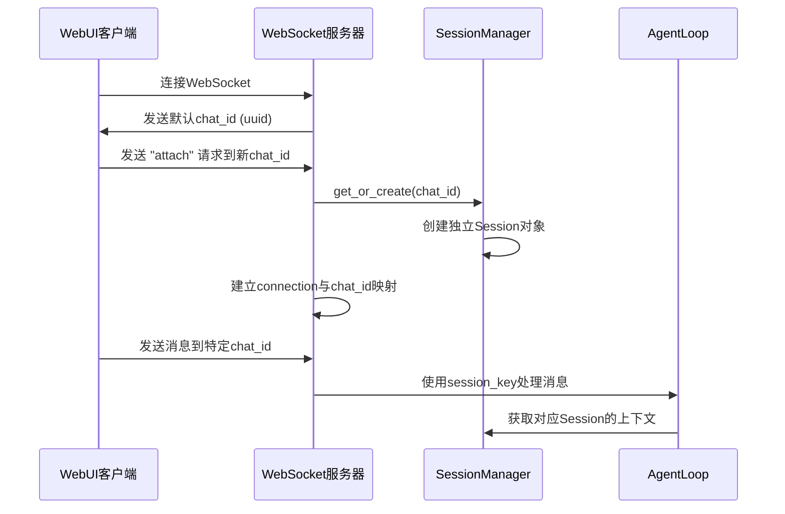

# nanobot 会话隔离机制分析

## 问题背景

在WebUI前端场景中，一个连接可能有10个聊天会话，后端如何保证这10个聊天会话每个都维持独立的上下文窗口？

## 核心机制分析

### 1. 会话键设计 (Session Key)

nanobot使用**会话键**来唯一标识每个聊天会话：

```python
# 会话键格式: channel:chat_id
"websocket:abc123"          # WebSocket频道 + 唯一ID
"telegram:group-456"        # Telegram群组
"api:user-789"             # API接口用户
```

### 2. WebSocket多连接管理

每个WebSocket连接维护多个chat_id的订阅关系：

```python
class WebSocketChannel(BaseChannel):
    # 三个关键数据结构
    _subs = {}           # chat_id -> connections (多对多映射)
    _conn_chats = {}     # connection -> chat_ids (连接订阅关系)
    _conn_default = {}   # connection -> default_chat_id (默认会话)
    
    def _attach(self, connection: Any, chat_id: str) -> None:
        """连接订阅到特定chat_id"""
        self._subs.setdefault(chat_id, set()).add(connection)
        self._conn_chats.setdefault(connection, set()).add(chat_id)
```

### 3. 会话创建流程



### 4. 会话上下文管理

#### Session对象结构
```python
@dataclass
class Session:
    key: str                    # "channel:chat_id"
    messages: list[dict]        # 独立的消息历史
    created_at: datetime        # 创建时间
    updated_at: datetime        # 最后更新时间
    metadata: dict              # 会话元数据
    last_consolidated: int      # 消息持久化偏移量
```

#### 上下文获取
```python
def get_history(self, max_messages: int = 500) -> list[dict]:
    """获取当前会话的消息历史"""
    # 1. 只获取未持久化的消息
    unconsolidated = self.messages[self.last_consolidated:]
    
    # 2. 截取最近的max_messages条
    sliced = unconsolidated[-max_messages:]
    
    # 3. 确保从user消息开始（避免工具调用孤岛）
    for i, message in enumerate(sliced):
        if message.get("role") == "user":
            sliced = sliced[i:]
            break
    
    return sliced
```

### 5. 消息路由机制

#### InboundMessage创建
```python
async def _handle_message(self, sender_id: str, chat_id: str, content: str) -> None:
    # 创建带有唯一会话键的消息
    msg = InboundMessage(
        channel=self.name,              # "websocket"
        sender_id=str(sender_id),       # 发送者ID
        chat_id=str(chat_id),           # 聊天会话ID
        content=content,                # 消息内容
        metadata={"remote": connection.remote_address},
        session_key_override=None       # 使用默认session_key
    )
    
    await self.bus.publish_inbound(msg)
```

#### AgentLoop会话选择
```python
def _effective_session_key(self, msg: InboundMessage) -> str:
    """根据配置和消息确定会话键"""
    if self._unified_session and not msg.session_key_override:
        return UNIFIED_SESSION_KEY  # 统一会话模式
    return msg.session_key          # 独立会话模式

# 在会话列表中查找对应会话
session = self.session_manager.get_or_effective(msg.session_key)
```

### 6. 具体场景示例

#### 场景1：单连接多会话
```
WebUI连接1
├── chat_id: "session-1"   -> 独立上下文A
├── chat_id: "session-2"   -> 独立上下文B
├── chat_id: "session-3"   -> 独立上下文C
└── default_chat_id         -> 默认会话D
```

#### 场景2：多连接多会话
```
WebUI连接1
├── chat_id: "group-chat"   -> 群组共享会话

WebUI连接2  
└── chat_id: "private-1"   -> 私人独立会话
```

### 7. 会话持久化

#### 消息存储
```python
class SessionManager:
    def _save(self, session: Session) -> None:
        """保存会话到JSONL文件"""
        path = self._get_session_path(session.key)
        
        # 追加模式保存新消息
        with open(path, 'a', encoding='utf-8') as f:
            for msg in session.messages[session.last_consolidated:]:
                f.write(json.dumps(msg) + '\n')
        
        session.last_consolidated = len(session.messages)
```

#### 会话恢复
```python
def get_or_create(self, key: str) -> Session:
    """获取现有会话或创建新会话"""
    if key in self._cache:
        return self._cache[key]
    
    # 从磁盘加载
    session = self._load(key)
    if session is None:
        # 创建新会话
        session = Session(key=key)
    
    self._cache[key] = session
    return session
```

### 8. 上下文窗口管理

#### 独立上下文窗口
```python
# 每个会话独立的上下文控制
async def _run_agent_loop(self, *, session: Session, chat_id: str):
    # 使用当前会话的消息历史
    history = session.get_history(max_messages=500)
    
    # 传入AgentRunSpec
    result = await self.runner.run(AgentRunSpec(
        initial_messages=history,  # 会话独立的历史
        session_key=session.key,    # 唯一会话键
        # ...其他参数
    ))
```

#### 上下文压缩
```python
def retain_recent_legal_suffix(self, max_messages: int) -> None:
    """保留最近的合法消息序列"""
    if len(self.messages) <= max_messages:
        return
    
    # 截断消息，但确保起始合法性
    start_idx = max(0, len(self.messages) - max_messages)
    while start_idx > 0 and self.messages[start_idx].get("role") != "user":
        start_idx -= 1
    
    self.messages = self.messages[start_idx:]
```

### 9. 并发控制

#### 会话任务队列
```python
class AgentLoop:
    def __init__(self):
        self._pending_queues = {}  # session_key -> asyncio.Queue
    
    async def run(self) -> None:
        while self._running:
            msg = await self.bus.consume_inbound()
            effective_key = self._effective_session_key(msg)
            
            # 检查会话是否已有活跃任务
            if effective_key in self._pending_queues:
                # 加入待处理队列（支持回合内注入）
                await self._pending_queues[effective_key].put(msg)
            else:
                # 创建新任务
                asyncio.create_task(self._process_message(msg, effective_key))
```

#### 任务隔离
```python
async def _process_message(self, msg: InboundMessage, session_key: str):
    """处理单条消息，确保会话隔离"""
    # 1. 获取会话
    session = self.session_manager.get_or_create(session_key)
    
    # 2. 创建专用队列
    queue = asyncio.Queue(maxsize=100)
    self._pending_queues[session_key] = queue
    
    try:
        # 3. 处理消息
        await self._run_agent_loop(
            initial_messages=session.get_history(),
            session=session,
            chat_id=msg.chat_id,
            # ...其他参数
        )
    finally:
        # 4. 清理
        del self._pending_queues[session_key]
```

## 关键设计要点

### 1. 唯一标识符
- **channel**: 频道标识（websocket/telegram等）
- **chat_id**: 聊天会话唯一ID
- **组合键**: `channel:chat_id` 确保全局唯一

### 2. 会话隔离
- 每个chat_id对应独立的Session对象
- 每个Session维护独立的消息历史
- 内存缓存 + 持久化存储双重保障

### 3. 消息路由
- 基于chat_id进行消息分发
- 支持单连接多chat_id订阅
- 避免消息串扰

### 4. 并发控制
- 每个会话独立的消息队列
- 支持回合内消息注入
- 防止并发处理冲突

### 5. 资源管理
- 自动清理过期会话
- 上下文窗口大小控制
- 内存使用优化

## 总结

nanobot通过以下机制确保多会话的上下文隔离：

1. **会话键系统**: 使用`channel:chat_id`作为唯一标识
2. **独立Session对象**: 每个会话维护独立的消息历史
3. **消息路由**: 基于chat_id进行精确路由
4. **并发控制**: 会话级别的任务队列隔离
5. **持久化机制**: 确保会话状态的持久性和恢复性

这种设计使得即使在一个WebSocket连接上，多个聊天会话也能完全独立地维护各自的上下文窗口，互不干扰。
