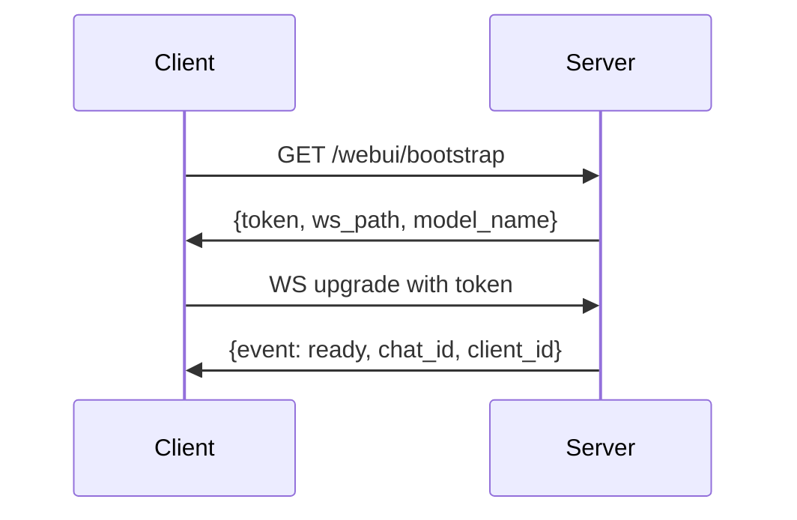
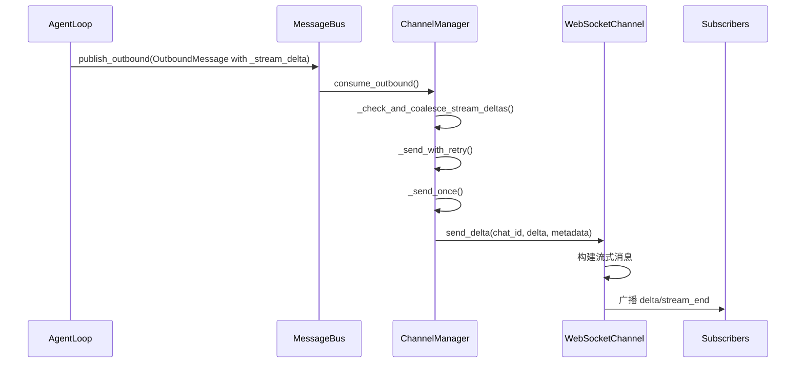

# websocket.py 详细分析

## 概述

`nanobot-0.1.5.post2/nanobot/channels/websocket.py` 实现了一个功能完善的 **WebSocket 服务器**，用于 agent与客户端的实时通信。以下是详细的代码解析。

主要添加的注释包括：

1. 模块级注释

- 解释了模块的整体功能和用途
- 说明了支持的主要特性

2. 配置类注释

- WebSocketConfig 类的详细说明
- 各配置项的作用和说明

3. 工具函数注释

- 路径处理函数（_strip_trailing_slash, _normalize_config_path）
- 消息解析函数（_parse_inbound_payload, _parse_envelope）
- 认证相关函数（_bearer_token, _issue_route_secret_matches）
- 安全检查函数（_is_localhost, _is_valid_chat_id）

4. 核心类注释

- WebSocketChannel 类的整体功能说明
- 初始化时数据结构的用途说明

5. 方法注释

- 订阅管理：_attach, _cleanup_connection
- 事件发送：_send_event
- HTTP 处理：_dispatch_http 及各个路由处理器
- 令牌管理：_handle_token_issue_http, _check_api_token
- WebSocket 生命周期：start, _connection_loop, stop
- 消息路由：_dispatch_envelope
- 消息发送：send, send_delta
- 静态文件服务：_serve_static

6. 关键设计点说明

- 令牌认证机制（静态令牌、动态令牌）
- 订阅系统的实现（chat_id 到连接的映射）
- 消息流式传输的处理
- 安全边界（仅允许 WebSocket 会话通过 WebUI 访问）
- 优雅关闭的实现

## 文件功能

实现了一个多功能的 WebSocket 服务器，支持：

- 多路复用 WebSocket 连接（**一个连接管理多个聊天会话**）
- HTTP API 服务（用于 Web UI 的 REST 接口）
- 静态文件服务（ SPA 支持）
- Token 认证和授权
- SSL/TLS 支持
- 流式响应

## 核心组件分析

### 1. 配置类 (WebSocketConfig)

```python
class WebSocketConfig(Base):
    enabled: bool = False                    # 启用标志
    host: str = "127.0.0.1"                  # 默认监听本地
    port: int = 8765                 
    path: str = "/"                         # WebSocket 路径
    token: str = ""                         # 静态 token
    token_issue_path: str = ""               # 动态 token 颁发路径
    token_issue_secret: str = ""             # token 颁发密钥
    token_ttl_s: int = 300                   # token 过期时间（5分钟）
    websocket_requires_token: bool = True  
    allow_from: list[str] = ["*"]            # 允许的客户端
    streaming: bool = True                   # 支持流式响应
    max_message_bytes: int = 1_048_576       # 最大消息大小（1MB）
    ping_interval_s: float = 20.0           # ping 间隔
    ping_timeout_s: float = 20.0             # ping 超时
    ssl_certfile: str = ""                   # SSL 证书文件
    ssl_keyfile: str = ""                   # SSL 密钥文件
```

### 2. Token 管理机制

服务器支持三种类型的 token：

#### 静态 Token

- 配置文件中硬编码的 token
- 用于简单认证场景

#### 动态 Token（API）

- 通过 HTTP API 颁发
- 路径：`/token_issue_path`
- 需要 `token_issue_secret` 保护
- 单次使用（WebSocket 握手时消耗）

#### Web UI Token

- 通过 `/webui/bootstrap` 颁发
- 仅限本地访问（localhost-only）
- 同时生成 WebSocket token 和 API token
- 包含 model_name 信息

```python
def _handle_webui_bootstrap(self, connection) -> Response:
    if not _is_localhost(connection):
        return _http_error(403, "webui bootstrap is localhost-only")
  
    # 生成新 token
    token = f"nbwt_{secrets.token_urlsafe(32)}"
    expiry = time.monotonic() + float(self.config.token_ttl_s)
  
    # 注册到两个池子
    self._issued_tokens[token] = expiry  # WebSocket 使用
    self._api_tokens[token] = expiry     # API 使用
  
    return _http_json_response({
        "token": token,
        "ws_path": self._expected_path(),
        "expires_in": self.config.token_ttl_s,
        "model_name": _read_webui_model_name(),
    })
```

### 3. 连接管理数据结构

```python
# 聊天 ID -> 订阅的连接（广播目标）
self._subs: dict[str, set[Any]] = {}

# 连接 -> 订阅的聊天 ID（快速清理）
self._conn_chats: dict[Any, set[str]] = {}

# 连接 -> 默认聊天 ID（兼容旧格式消息）
self._conn_default: dict[Any, str] = {}

# 单次使用的 token（WebSocket 握手）
self._issued_tokens: dict[str, float] = {}

# API token（多使用，TTL）
self._api_tokens: dict[str, float] = {}
```

## 消息处理流程

### 1. 连接建立流程 (`_connection_loop`)

```python
async def _connection_loop(self, connection: Any) -> None:
    # 1. 解析 client_id
    client_id = client_id_raw.strip() if client_id_raw else ""
    if not client_id:
        client_id = f"anon-{uuid.uuid4().hex[:12]}"
  
    # 2. 创建默认聊天 ID
    default_chat_id = str(uuid.uuid4())
  
    # 3. 发送 ready 事件
    await connection.send({
        "event": "ready",
        "chat_id": default_chat_id,
        "client_id": client_id,
    })
  
    # 4. 注册连接和默认聊天
    self._conn_default[connection] = default_chat_id
    self._attach(connection, default_chat_id)
  
    # 5. 消息处理循环
    async for raw in connection:
        # 解析并路由消息
        envelope = _parse_envelope(raw)
        if envelope is not None:
            await self._dispatch_envelope(connection, client_id, envelope)
            continue
  
        content = _parse_inbound_payload(raw)
        if content is None:
            continue
  
        # 发送到消息总线
        await self._handle_message(
            sender_id=client_id,
            chat_id=default_chat_id,
            content=content,
            metadata={"remote": getattr(connection, "remote_address", None)},
        )
```

### 2. 消息格式支持

#### 新格式（Envelope）

```json
{
    "type": "message",      // 类型：new_chat/attach/message
    "chat_id": "chat123",  // 聊天 ID
    "content": "Hello"     // 消息内容
}
```

#### 旧格式（直接文本）

```json
{"content": "Hello"}
// 或直接
"Hello"
```

#### 响应格式

- **普通消息**：

  ```json
  {
      "event": "message",
      "chat_id": "...",
      "text": "..."
  }
  ```
- **流式增量**：

  ```json
  {
      "event": "delta",
      "chat_id": "...",
      "text": "..."
  }
  ```
- **流式结束**：

  ```json
  {
      "event": "stream_end",
      "chat_id": "..."
  }
  ```
- **工具提示**：

  ```json
  {
      "event": "message",
      "chat_id": "...",
      "text": "...",
      "kind": "tool_hint"  // 或 "progress"
  }
  ```

### 3. Envelope 消息分发 (`_dispatch_envelope`)

```python
async def _dispatch_envelope(self, connection, client_id, envelope):
    t = envelope.get("type")
  
    if t == "new_chat":
        # 创建新聊天
        new_id = str(uuid.uuid4())
        self._attach(connection, new_id)
        await self._send_event(connection, "attached", chat_id=new_id)
  
    elif t == "attach":
        # 加入现有聊天
        cid = envelope.get("chat_id")
        if _is_valid_chat_id(cid):
            self._attach(connection, cid)
            await self._send_event(connection, "attached", chat_id=cid)
    
    elif t == "message":
        # 发送消息
        cid = envelope.get("chat_id")
        content = envelope.get("content")
        if _is_valid_chat_id(cid) and content.strip():
            # 自动订阅
            self._attach(connection, cid)
            await self._handle_message(
                sender_id=client_id,
                chat_id=cid,
                content=content,
                metadata={"remote": getattr(connection, "remote_address", None)},
            )
```

## HTTP API 路由

### 1. Token 颁发

```
GET /token_issue_path
Authorization: Bearer <secret>

Response: {"token": "nbwt_xxx", "expires_in": 300}
```

### 2. Web UI Bootstrap

```
GET /webui/bootstrap (localhost only)

Response: {
    "token": "nbwt_xxx",
    "ws_path": "/",
    "expires_in": 300,
    "model_name": "gpt-4"
}
```

### 3. 会话管理

```
GET /api/sessions
Authorization: Bearer <token>
Response: {"sessions": [...]}

GET /api/sessions/{key}/messages
Authorization: Bearer <token>
Response: {messages: [...]}

GET /api/sessions/{key}/delete
Authorization: Bearer <token>
Response: {"deleted": true}
```

### 4. 静态文件服务

- 支持 SPA 路由（history mode）
- hash 文件名永久缓存
- index.html 设置 `no-cache`
- 防止路径遍历攻击

## 关键设计特点

### 1. 多路复用架构

- 一个 WebSocket 连接可以订阅多个聊天
- 使用 `chat_id` 进行消息路由
- 支持同时参与多个会话

### 2. 安全机制

#### Token 认证

```python
def _authorize_websocket_handshake(self, connection, query):
    supplied = _query_first(query, "token")
    static_token = self.config.token.strip()
  
    # 检查静态 token
    if static_token and hmac.compare_digest(supplied, static_token):
        return None
  
    # 检查动态 token（单次使用）
    if supplied and self._take_issued_token_if_valid(supplied):
        return None
  
    return connection.respond(401, "Unauthorized")
```

#### 访问控制

- `allow_from` 列表限制来源 IP
- Web UI 相关接口仅限 localhost
- API 路径需要有效的 token

#### 输入验证

```python
# chat_id 格式验证
_CHAT_ID_RE = re.compile(r"^[A-Za-z0-9_:-]{1,64}$")

def _is_valid_chat_id(value):
    return isinstance(value, str) and _CHAT_ID_RE.match(value) is not None
```

### 3. 错误处理

- 连接断开自动清理订阅
- 优雅的错误响应（HTTP 401/403/404/500）
- 详细的日志记录

### 4. 性能优化

- 连接池管理（快速订阅/取消）
- 消息批量发送（避免频繁 I/O）
- 静态文件缓存策略
- 自动清理过期 token

## WebSocket 协议细节

### 握手认证流程

1. 客户端连接：`ws://host:port/path?token=xxx&client_id=yyy`
2. 服务器验证 token
3. 返回 `ready` 事件
4. 开始双向通信

### 消息分发机制

```python
async def send(self, msg: OutboundMessage):
    # 向所有订阅了 chat_id 的连接广播
    conns = list(self._subs.get(msg.chat_id, ()))
    for connection in conns:
        await self._safe_send_to(connection, raw)

async def send_delta(self, chat_id, delta, metadata=None):
    # 发送流式更新
    for connection in conns:
        await self._safe_send_to(connection, raw, label=" stream ")
```

## Web UI 集成

这个 WebSocket 服务器专门为 Web UI 设计：

### 1. 认证流程



### 2. 消息流程

```
Web UI (React) 
    ↓ (WebSocket)
WebSocket Server 
    ↓ (MessageBus)
Agent Loop
    ↓ (LLM Provider)
Agent Runner
    ↓ (Tool Registry)
Tools Execution
```

### 3. 工具调用支持

- 工具提示标记为 `kind: "tool_hint"`
- 自动合并连续的工具调用
- 在 UI 中显示为可折叠的调试信息

## 总结

`websocket.py` 实现了一个企业级的 WebSocket 服务器，具有以下特点：

1. **完善的认证授权机制**：支持静态/动态 token，HMAC 安全验证
2. **灵活的消息路由**：多路复用支持，chat_id 路由
3. **REST API 集成**：支持会话管理，静态文件服务
4. **流式响应支持**：实时显示 AI 生成内容
5. **错误处理和日志**：完善的异常处理和调试信息
6. **Web UI 优化**：专门为浏览器客户端设计的功能

它是 nanobot 机器人与 Web UI 通信的核心组件，支持实时聊天、流式响应和多会话管理，展现了现代 WebSocket 服务器的最佳实践。

## 函数调用关系分析

### 1. **启动流程**

```
WebSocketChannel.__init__()
    ↓
WebSocketChannel.start()
    ↓
build SSL context (if configured)
    ↓
serve()  # websockets.asyncio.server
    ↓
process_request()  # HTTP请求处理
    ↓
dispatch_http()   # 路由到具体处理器
```

```bash
http://127.0.0.1:5173/webui/bootstrap
{"token": "nbwt_dTUuPe3OV4EyoJd_wE4VylInBzGcqGXacSlU69Vl1jE", "ws_path": "/", "expires_in": 300, "model_name": "glm-4.7"}
token: WebSocket认证令牌
expires_in: 令牌过期时间
```

### 2. **HTTP 请求处理流程**

```
_dispatch_http(connection, request)
    ↓
┌─────────────────────────────────────────────────────┐
│ 路由判断                                            │
├─────────────────────────────────────────────────────┤
│ /token_issue_path → _handle_token_issue_http()       │
│ /webui/bootstrap → _handle_webui_bootstrap()        │ 返回token、token过期时间、模型名字
│ /api/sessions → _handle_sessions_list()            │
│ /api/sessions/.../messages → _handle_session_messages() │
│ /api/sessions/.../delete → _handle_session_delete()  │
│ WebSocket upgrade → _authorize_websocket_handshake() │
│ Static files → _serve_static()                      │
└─────────────────────────────────────────────────────┘
```

### 3. **WebSocket 连接处理流程**

```
_connection_loop(connection)
    ↓
解析 client_id 和生成 default_chat_id
    ↓
发送 "ready" 事件
    ↓
_attach(connection, default_chat_id)  # 注册连接
    ↓
消息循环 async for raw in connection:
    ↓
┌─────────────────────────────────────────────────────┐
│ 消息类型判断                                        │
├─────────────────────────────────────────────────────┤
│ JSON envelope → _dispatch_envelope()                 │
│ 纯文本/旧格式 → _parse_inbound_payload()            │
│ 无效内容 → continue                                 │
└─────────────────────────────────────────────────────┘
    ↓
_handle_message()  # 通过基类发送到 MessageBus
```

### 4. **Envelope 消息分发流程**

```
_dispatch_envelope(connection, client_id, envelope)
    ↓
envelope.get("type")
    ↓
┌─────────────────────────────────────────────────────┐
│ 类型处理                                            │
├─────────────────────────────────────────────────────┤
│ "new_chat" →                                         │
│   ├─ 生成 new_id = str(uuid.uuid4())                │
│   ├─ _attach(connection, new_id)                     │
│   └─ _send_event(connection, "attached", chat_id=new_id) │
│                                                     │
│ "attach" →                                          │
│   ├─ 验证 chat_id                                   │
│   ├─ _attach(connection, chat_id)                    │
│   └─ _send_event(connection, "attached", chat_id=cid) │
│                                                     │
│ "message" →                                        │
│   ├─ 验证 chat_id 和内容                            │
│   ├─ _attach(connection, chat_id)  # 自动订阅        │
│   └─ _handle_message()                              │
└─────────────────────────────────────────────────────┘
```

handle_message() 会构建msg = InboundMessage()，然后发送给消息总线 self.bus.publish_inbound(msg)。

```bash
    async def _handle_message(
        self,
        sender_id: str,
        chat_id: str,
        content: str,
        media: list[str] | None = None,
        metadata: dict[str, Any] | None = None,
        session_key: str | None = None,
    ) -> None:
        """
        Handle an incoming message from the chat platform.

        This method checks permissions and forwards to the bus.

        Args:
            sender_id: The sender's identifier.
            chat_id: The chat/channel identifier.
            content: Message text content.
            media: Optional list of media URLs.
            metadata: Optional channel-specific metadata.
            session_key: Optional session key override (e.g. thread-scoped sessions).
        """
        ......

        msg = InboundMessage(
            channel=self.name,
            sender_id=str(sender_id),
            chat_id=str(chat_id),
            content=content,
            media=media or [],
            metadata=meta,
            session_key_override=session_key,
        )

        await self.bus.publish_inbound(msg)

```

### 5. **消息发送流程**

```
# 发送普通消息
WebSocketChannel.send(msg: OutboundMessage)
    ↓
构建 payload:
{
    "event": "message",
    "chat_id": msg.chat_id,
    "text": msg.content,
    # 可选: media, reply_to, kind
}
    ↓
_safe_send_to(connection, raw)  # 发送给所有订阅者

# 发送流式消息
WebSocketChannel.send_delta(chat_id, delta, metadata)
    ↓
判断是否流式结束
    ↓
构建 payload:
┌─────────────────────────────────────────────────────┐
│ meta.get("_stream_end") →                           │
│   {"event": "stream_end", "chat_id": chat_id}       │
│ 否则 →                                             │
│   {"event": "delta", "chat_id": chat_id, "text": delta} │
└─────────────────────────────────────────────────────┘
    ↓
_safe_send_to(connection, raw, label=" stream ")
```

### 6. **send_delta 的完整调用链**

```
AgentLoop._dispatch()  # Agent 接收消息
    ↓
检查 msg.metadata.get("_wants_stream")
    ↓
定义 on_stream(delta: str) 回调函数
    ↓
设置 meta["_stream_delta"] = True
    ↓
await self.bus.publish_outbound(OutboundMessage(...))
    ↓
ChannelManager.consume_outbound()  # 消费出站消息
    ↓
_check_and_coalesce_stream_deltas()  # 合并连续的 delta
    ↓
_send_with_retry() → _send_once()
    ↓
检查 msg.metadata.get("_stream_delta")
    ↓
WebSocketChannel.send_delta(chat_id, delta, metadata)
    ↓
发送流式 WebSocket 消息
```

### 6. **认证流程**

websocket握手授权的核心逻辑：**验证websocket连接请求的认证信息，决定是否运行建立连接**。

```
_authorize_websocket_handshake(connection, query)
    ↓
_query_first(query, "token") 获取 supplied token
    ↓
┌─────────────────────────────────────────────────────┐
│ 认证方式                                           │
├─────────────────────────────────────────────────────┤
│ 静态 token →                                        │
│   ├─ 检查 hmac.compare_digest(supplied, static_token) │
│   ├─ 匹配成功 → 返回 None (通过)                     │
│   └─ 匹配失败 → 返回 401                             │
│                                                     │
│ 动态 token →                                        │
│   ├─ _take_issued_token_if_valid(supplied)         │
│   ├─ 有效 → 返回 None (通过)                         │
│   └─ 无效 → 返回 401                                │
│                                                     │
│ 无需 token →                                        │
│   ├─ 直接返回 None (通过)                           │
└─────────────────────────────────────────────────────┘
```

### 7. **Token 管理流程**

```
# 颁发新 token
_handle_webui_bootstrap(connection)
    ↓
检查 localhost
    ↓
_purge_expired_issued_tokens()  # 清理过期 token
    ↓
检查 token 数量上限
    ↓
生成 token = f"nbwt_{secrets.token_urlsafe(32)}"
    ↓
注册到两个池子:
   self._issued_tokens[token] = expiry  # WebSocket 使用
   self._api_tokens[token] = expiry     # API 使用
    ↓
返回响应

# 验证动态 token
_take_issued_token_if_valid(token_value)
    ↓
_purge_expired_issued_tokens()
    ↓
查找 token 在 _issued_tokens 中
    ↓
检查是否过期
    ↓
有效 → 从池中移除并返回 True
无效 → 返回 False
```

### 8. **连接清理流程**

```
_connection_loop 异常/结束时
    ↓
finally 块执行
    ↓
_cleanup_connection(connection)
    ↓
┌─────────────────────────────────────────────────────┐
│ 清理步骤                                           │
├─────────────────────────────────────────────────────┤
│ 1. 从 _conn_chats 移除连接的所有订阅                │
│ 2. 从各 _subs[chat_id] 中移除连接                   │
│ 3. 清理空的 _subs 条目                              │
│ 4. 移除 _conn_default 中的连接                      │
└─────────────────────────────────────────────────────┘

# 发送失败时自动清理
_safe_send_to(connection, raw, label="")
    ↓
捕获 ConnectionClosed
    ↓
调用 _cleanup_connection(connection)
```

### 9. **静态文件服务流程**

```
_serve_static(request_path)
    ↓
路径规范化 (去除前导 /)
    ↓
安全检查 (防止路径遍历)
    ↓
查找文件
    ↓
┌─────────────────────────────────────────────────────┐
│ 文件查找                                           │
├─────────────────────────────────────────────────────┤
│ 文件存在 → 读取文件内容                             │
│ 文件不存在 + index.html 存在 → 使用 index.html       │
│ 都不存在 → 返回 None                                 │
└─────────────────────────────────────────────────────┘
    ↓
确定 Content-Type
    ↓
设置 Cache-Control:
   index.html → "no-cache"
   其他 → "public, max-age=315360000, immutable"
    ↓
返回 HTTP 响应
```

### 10. **会话管理流程**

```
_handle_sessions_list(request)
    ↓
_check_api_token(request)  # 验证 token
    ↓
_session_manager.list_sessions()
    ↓
过滤 websocket: 开头的会话
    ↓
移除 path 字段
    ↓
返回 {"sessions": cleaned}

_handle_session_messages(request, key)
    ↓
_decode_api_key(key)  # URL解码并验证
    ↓
检查是否为 websocket: 会话
    ↓
_session_manager.read_session_file(decoded_key)
    ↓
返回会话消息数据
```

## 关键协作模式

### 1. **订阅模式**

- `_attach()` - 建立连接与聊天 ID 的双向映射
- `send()` - 根据 chat_id 找到所有订阅的连接
- `_cleanup_connection()` - 断开时清理所有订阅关系

### 2. **事件驱动模式**

- `_send_event()` - 发送控制事件（ready, attached, error）
- `send_delta()` - 发送流式更新事件
- `send()` - 发送普通消息事件

### 3. **中间件模式**

- `dispatch_http()` - HTTP 请求路由中间件
- `_authorize_websocket_handshake()` - WebSocket 认证中间件
- `_safe_send_to()` - 发送异常处理中间件

### 4. **策略模式**

- Token 认证支持多种策略（静态、动态、无认证）
- 消息路由根据类型选择不同处理策略
- 静态文件服务根据路径选择不同策略

这个 WebSocket 服务器的设计体现了高度的内聚和低耦合，各个函数职责清晰，通过明确的接口进行协作，形成了一个完整的实时通信系统。

## send_delta 的完整调用链路

### 触发条件

`send_delta` 只有在满足以下条件时才会被调用：

1. 消息的 metadata 中包含 `_stream_delta` 或 `_stream_end`
2. WebSocket 服务器配置中启用了 `streaming: True`

### 完整调用流程



### 详细步骤说明

1. **Agent Loop 层**

   ```python
   # nanobot/agent/loop.py:586
   meta["_stream_delta"] = True
   await self.bus.publish_outbound(OutboundMessage(
       channel=msg.channel, chat_id=msg.chat_id,
       content=delta,
       metadata=meta,
   ))
   ```
2. **Channel Manager 层**

   ```python
   # nanobot/channels/manager.py:244
   if msg.metadata.get("_stream_delta") or msg.metadata.get("_stream_end"):
       await channel.send_delta(msg.chat_id, msg.content, msg.metadata)
   ```
3. **WebSocket Channel 层**

   ```python
   # nanobot/channels/websocket.py:854
   async def send_delta(self, chat_id: str, delta: str, metadata: dict[str, Any] | None = None):
       if meta.get("_stream_end"):
           body = {"event": "stream_end", "chat_id": chat_id}
       else:
           body = {"event": "delta", "chat_id": chat_id, "text": delta}

       for connection in conns:
           await self._safe_send_to(connection, raw, label=" stream ")
   ```

### 流式消息合并优化

Channel Manager 实现了流式消息的合并机制，当 LLM 生成速度超过通道处理速度时：

```python
# nanobot/channels/manager.py:249
def _coalesce_stream_deltas(self, first_msg):
    """合并连续的 _stream_delta 消息"""
    # 将多个 delta 合并为一个消息，减少网络调用
    # 直到遇到 _stream_end 或非 delta 消息为止
```

### Web UI 中的处理

在 Web UI 中，流式消息通过以下方式处理：

```typescript
// src/hooks/useNanobotStream.ts
if (ev.event === "delta") {
    // 累积 delta 片段
    buffer.current.parts.push(ev.text);
    // 实时更新 UI
    setMessages(prev => updateContent(prev, id, combined));
}

if (ev.event === "stream_end") {
    // 结束流式，更新最终状态
    buffer.current = null;
    setIsStreaming(false);
}
```

## connection、chatid关系？

在 WebSocket 服务器实现中，chat_id 和 connection 是两个核心但不同的概念，它们之间的关系是这个多客户端聊天系统的关键。

  Connection vs Chat ID

  Connection（连接）

- 定义：一个实际的 WebSocket 网络连接
- 生命周期：从连接建立到断开
- 数量：每个客户端浏览器/应用通常有一个连接
- 标识：使用 connection 对象本身作为键

  Chat ID（聊天标识）
- 定义：一个虚拟的**聊天会话**
- 生命周期：从创建到删除（或永久存在）
- 数量：可以有多个聊天会话
- 标识：字符串格式，如 "websocket:uuid" 或 "unified:default"

  两者的关系

1. 一对一关系（默认）

  client_1_connection -> chat_id_1 (default)
  client_2_connection -> chat_id_2 (default)

  新连接时自动创建默认的 chat_id。

● 这个 JSON 消息序列展示了 WebSocket 服务器中加入聊天会话的完整流程。让我详细解释这个过程：

  消息流程详解

1. 客户端发送 attach 请求

  {
    "type": "attach",
    "chat_id": "f1dd4ab7-4eb6-4153-bc92-1ef7984b3120"
  }

  含义：

- type: "attach" - 客户端请求加入一个**现有的聊天会话**
- chat_id: "f1dd4ab7-4eb6-4153-bc92-1ef7984b3120" - 要加入的聊天会话 ID

2. 服务器处理并响应

  {
    "event": "attached",
    "chat_id": "f1dd4ab7-4eb6-4153-bc92-1ef7984b3120"
  }

  含义：

- event: "attached" - 服务器确认客户端已成功加入聊天
- chat_id: "f1dd4ab7-4eb6-4153-bc92-1ef7984b3120" - 确认的聊天会话 ID

1. {type: "message", chat_id: "f1dd4ab7-4eb6-4153-bc92-1ef7984b3120", content: "人类为什么焦虑"}
   1. **chat_id**: **"f1dd4ab7-4eb6-4153-bc92-1ef7984b3120"**
   2. **content**: **"人类为什么焦虑"**
   3. **type**: **"message"**

```bash
{event: "ready", chat_id: "5d5f98fd-e1fe-4389-bf7d-556cb84aedea", client_id: "anon-310ef2afa63b"}
chat_id: "5d5f98fd-e1fe-4389-bf7d-556cb84aedea"
client_id: "anon-310ef2afa63b"
event: "ready"

{event: "ready", chat_id: "a57c0d43-64e3-43ca-b436-ef9ddaf825ed", client_id: "anon-6b3803d0dc86"}
chat_id: "a57c0d43-64e3-43ca-b436-ef9ddaf825ed"
client_id: "anon-6b3803d0dc86"
event: "ready"


```

```bash
# 1 客户端：新建一个新的聊天会话
{type: "new_chat"}
type: "new_chat"

# 2 服务器响应：自动加入
{event: "attached", chat_id: "81038d58-4c88-4b8e-91de-40a71536b198"}
chat_id: "81038d58-4c88-4b8e-91de-40a71536b198"
event: "attached"

# 3 客户端确认加入
{type: "attach", chat_id: "81038d58-4c88-4b8e-91de-40a71536b198"}
chat_id: "81038d58-4c88-4b8e-91de-40a71536b198"
type: "attach"

# 4 服务器再次确认
{event: "attached", chat_id: "81038d58-4c88-4b8e-91de-40a71536b198"}
chat_id: "81038d58-4c88-4b8e-91de-40a71536b198"
event: "attached"

# 5 客户端发送消息
{type: "message", chat_id: "81038d58-4c88-4b8e-91de-40a71536b198", content: "晚上好"}
chat_id: "81038d58-4c88-4b8e-91de-40a71536b198"
content: "晚上好"
type: "message"

# 6 服务器 
# chatid就是：websocket
{event: "delta", chat_id: "81038d58-4c88-4b8e-91de-40a71536b198", text: "晚上",…}
chat_id: "81038d58-4c88-4b8e-91de-40a71536b198"
event: "delta"
stream_id: "websocket:81038d58-4c88-4b8e-91de-40a71536b198:1778157005724112614:0"
text: "晚上"


```

```
{event: "delta", chat_id: "f1dd4ab7-4eb6-4153-bc92-1ef7984b3120", text: "消除",…}
chat_id: "f1dd4ab7-4eb6-4153-bc92-1ef7984b3120"
event: "delta"
stream_id: "websocket:f1dd4ab7-4eb6-4153-bc92-1ef7984b3120:1778156509451953835:0"
text: "消除"

{event: "stream_end", chat_id: "f1dd4ab7-4eb6-4153-bc92-1ef7984b3120",…}
chat_id: "f1dd4ab7-4eb6-4153-bc92-1ef7984b3120"
event: "stream_end"
stream_id: "websocket:f1dd4ab7-4eb6-4153-bc92-1ef7984b3120:1778156509451953835:0"


```

client_id 的生成逻辑

1. 从查询参数获取（优先级最高）

  // 客户端连接时可以通过 URL 参数指定 client_id  // 例如：ws://127.0.0.1:8765/?client_id=my-custom-id  const rawClientId = _query_first(query, "client_id");  if (rawClientId) {
    client_id = rawClientId.strip();
    if (len(client_id) > 128) {
    client_id = client_id[:128];  // 限制长度
    }  }

2. 自动生成匿名 ID（如果没有提供）

  // **如果没有提供 client_id，则生成匿名 ID**
  if (!client_id) {
    **client_id = f"anon-{uuid.uuid4().hex[:12]}";**
  }

  完整的 client_id 处理流程

  在 _connection_loop 方法中（lines 1146-1152）：

1. 从查询参数获取 client_id

  client_id_raw = _query_first(query, "client_id")
  client_id = client_id_raw.strip() if client_id_raw else ""

2. 如果为空，生成匿名 ID

  if not client_id:
    client_id = f"anon-{uuid.uuid4().hex[:12]}"
  elif len(client_id) > 128:
    # 3. 如果太长，截断并警告
    logger.warning("websocket: client_id too long ({} chars), truncating", len(client_id))
    client_id = client_id[:128]

## handler 函数中 connection 参数的来源

让我详细解释 handler 函数中 connection 参数的来源。

  connection 参数的来源

1. WebSocket 连接建立流程

  async with serve(
    handler,  # ← 这里！
    host,
    port,
    ...
  ):

  当 serve 启动后：

1. 客户端连接请求：客户端发起 WebSocket 连接（如 ws://host:port/path）
2. 服务器接受连接：**serve 接受连接并创建一个 ServerConnection 对象**
3. 调用 handler：serve 自动将这个 ServerConnection 对象作为参数传递给 handler 函数
4. ServerConnection 是什么？

  根据 websockets 库的文档，ServerConnection 代表：

- 一个已建立的 WebSocket 连接
- 提供发送/接收消息的方法
- 包含连接的元信息（如客户端地址、请求头等）

3. 在代码中的体现

  让我们查看 _connection_loop 的使用：

  async def handler(connection: ServerConnection) -> None:
    """处理每个 WebSocket 连接的整个生命周期。"""
    await self._connection_loop(connection)  # ← connection 被传递

3. 在代码中的体现

  让我们查看 _connection_loop 的使用：

  async def handler(connection: ServerConnection) -> None:
      """处理每个 WebSocket 连接的整个生命周期。"""
      await self._connection_loop(connection)  # ← connection 被传递

  async def _connection_loop(self, connection: Any) -> None:
      """处理单个 WebSocket 连接的整个生命周期。"""
      request = connection.request  # 获取 HTTP 请求信息
      path_part = request.path if request else "/"
      # ... 处理连接

4. 完整的数据流

  客户端发起连接 → serve() → 创建 ServerConnection → handler() → _connection_loop()

5. ServerConnection 的主要功能

  在 _connection_loop 中，connection 对象被用来：

1. 获取请求信息

  request = connection.request
  path_part = request.path if request else "/"

2. 发送消息给客户端

  await connection.send(json.dumps(payload, ensure_ascii=False))

3. 接收客户端消息

  async for raw in connection:
    # 处理消息...

4. 获取客户端地址

  addr = getattr(connection, "remote_address", None)

6. websockets 库的内部机制

  在 websockets 库中：

serve() 函数内部大致是这样工作的：

  async def serve(handler, host, port, ...):
    server = await loop.create_server(
    lambda reader, writer: _create_connection(handler, reader, writer),
    host, port, ...
    )

  async def _create_connection(handler, reader, writer):
    connection = ServerConnection(reader, writer, ...)
    await handler(connection)  # ← 关键！调用 handler 并传入 connection

7. 为什么使用这种设计？

  这种设计的好处：

- 解耦：服务器逻辑与连接管理分离
- 并发：每个连接有独立的处理循环
- 清晰：handler 函数专注于业务逻辑
- 标准化：符合 websockets 库的约定

8. 与其他框架的对比

  类似的设计在其他框架中也存在：

- FastAPI：WebSocketEndpoint 的 websocket 参数
- Django Channels：WebSocketConsumer 的 self.scope
- Socket.IO：socket 对象

  总结：connection 是 serve 函数在接受客户端连接时自动创建并传递给 handler 的 ServerConnection 对象，代表了与客户端的 WebSocket 连接实例。


## 如何区分使用handler还是process_request处理器


求区分机制

1. WebSocket 升级请求 → handler

  当客户端想要建立 WebSocket 连接时，会发送一个特殊的 HTTP 请求：

  GET /path?client_id=...&token=... HTTP/1.1
  Host: example.com
  **Upgrade: websocket
  Connection: Upgrade**
  Sec-WebSocket-Key: dGhlIHNhbXBsZSBub25jZQ==
  Sec-WebSocket-Version: 13

  关键特征：

- 包含 Upgrade: websocket 头
- 包含 Connection: Upgrade 头
- websockets 库的 serve 函数会检测到这些头，自动将请求路由到 handler 函数

2. 普通 HTTP 请求 → process_request

  对于普通的 HTTP 请求（如 API 调用、静态文件请求等）：

  GET /webui/bootstrap HTTP/1.1
  Host: example.com

  GET /api/sessions HTTP/1.1
  Host: example.com
  Authorization: Bearer token123
  这些请求没有 WebSocket 升级头，所以会被路由到 process_request 函数。

  代码中的处理流程

  _dispatch_http 中的关键检查

  在 process_request 函数内部（即 _dispatch_http），有一个重要的检查：

4. WebSocket 升级（主要功能）：

只对实际要求升级的请求运行握手验证，

否则裸露的 "GET /" 会被拒绝为未授权的 WebSocket 握手

而不是提供 SPA 的 index.html

  expected_ws = self._expected_path()
  if got == expected_ws and _is_websocket_upgrade(request):
    # WebSocket 握手处理
    client_id = _query_first(query, "client_id") or ""
    if len(client_id) > 128:
    client_id = client_id[:128]
    if not self.is_allowed(client_id):
    return connection.respond(403, "Forbidden")
    return self._authorize_websocket_handshake(connection, query)

  _is_websocket_upgrade 函数的判断逻辑

  def _is_websocket_upgrade(request: WsRequest) -> bool:
    """检测是否为真正的 WebSocket 升级请求。

    通过检查以下头部来确认：
    - Upgrade: websocket
    - Connection: upgrade

    普通 HTTP GET 请求应该通过这里而不被处理。

    Args:
    request: WebSockets HTTP 请求对象

    Returns:
    如果是 WebSocket 升级请求则返回 True
    """
    upgrade = request.headers.get("Upgrade") or request.headers.get("upgrade")
    connection = request.headers.get("Connection") or request.headers.get("connection")
    if not upgrade or "websocket" not in upgrade.lower():
    return False
    if not connection or "upgrade" not in connection.lower():
    return False
    return True

  实际场景示例

  场景 1：用户询问 "中国的面积"

  GET /?query=中国的面积 HTTP/1.1
  Host: localhost:8765

  处理流程：

1. websockets 库收到请求，发现没有 Upgrade 头
2. _dispatch_http 检查路径，发现匹配 WebSocket 路径
3. 调用 _is_websocket_upgrade，返回 False（因为没有升级头）
4. 继续检查其他路由（静态文件服务等）
5. 如果没有匹配的路由，返回 404


  场景 2：**客户端建立 WebSocket 连接**

 **GET /?client_id=user123&token=abc HTTP/1.1
  Host: localhost:8765
  Upgrade: websocket
  Connection: Upgrade**

  处理流程：

1. websockets 库收到请求，发现有 Upgrade: websocket 头
2. 自动将请求路由到 handler 函数
3. handler 调用 _connection_loop 开始处理 WebSocket 连接
4. 发送 "ready" 事件，建立连接


  场景 3：WebUI 调用 API

  GET /webui/bootstrap HTTP/1.1
  Host: localhost:8765

  处理流程：

1. websockets 库收到请求，没有 Upgrade 头
2. 路由到 process_request（_dispatch_http）
3. 路径匹配 /webui/bootstrap
4. 调用 _handle_webui_bootstrap 处理请求


  总结

  区分的关键在于 HTTP 请求头：

- 有 Upgrade: websocket → handler → WebSocket 连接
- 无 Upgrade 头 → process_request → HTTP 请求处理

  这种设计使得同一个端口可以同时处理：

- WebSocket 连接（实时通信）
- HTTP API 请求（WebUI 集成）
- 静文件服务（SPA 支持）

  区分的关键在于 HTTP 请求头：
  处理流程：

1. websockets 库收到请求，没有 Upgrade 头
2. 路由到 process_request（_dispatch_http）
3. 路径匹配 /webui/bootstrap
4. 调用 _handle_webui_bootstrap 处理请求


  总结

  区分的关键在于 HTTP 请求头：

- **有 Upgrade: websocket → handler → WebSocket 连接**
- **无 Upgrade 头 → process_request → HTTP 请求处理**


  这种设计使得同一个端口可以同时处理：

- WebSocket 连接（实时通信）
- HTTP API 请求（WebUI 集成）
- 静文件服务（SPA 支持）

  这就是为什么用户发送 "中国的面积" 这样的普通 HTTP 请求会被正确路由到 HTTP 处理器，而不会错误地建立 WebSocket 连接。
